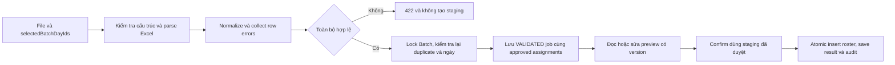

# Kế hoạch làm lại use case Health Examination, import Excel và CRUD

> Trạng thái: kế hoạch đề xuất ngày 04/10/2026, chưa triển khai refactor.
> Khi triển khai: dùng `superpowers:executing-plans`, thực hiện từng task và cập nhật checkbox theo kết quả thực tế. Chỉ tạo class/package khi task tương ứng được triển khai; các file mới dưới đây là đề xuất trong kế hoạch.

**Mục tiêu:** chuẩn hóa các use case của `healthexamination` theo clean-slate database; hoàn thiện CRUD có kiểm soát, import roster và các bước nghiệp vụ liên quan mà vẫn giữ lịch sử, quyền truy cập và ranh giới module.

**Kiến trúc:** DDD + modular monolith + package theo bounded context; mỗi module giữ `api → application → domain`, infrastructure triển khai các port. Refactor từng luồng có kiểm thử, tận dụng implementation đã chuyển sang schema mới.

**Stack:** Java 25, Spring Boot 4.x, Spring Framework 7.x, PostgreSQL 18, MyBatis starter 4.x, Spring Modulith 2.x, Maven, Flyway. Giữ thư viện Excel Fesod đang có; không thêm ORM, framework CQRS hay import engine mới chỉ để refactor.

**Đặc tả áp dụng:** [ADR-0013](../adr/0013-clean-slate-application-contract.md), [ADR-0012](../adr/0012-clean-slate-module-boundaries.md), [domain/workflows](../architecture/03-domain-and-workflows.md) và [V001](../../src/main/resources/db/migration/V001__create_clean_slate_schema.sql).

## 1. Phạm vi và thứ tự ưu tiên

| Ưu tiên | Phạm vi | Kết quả cần đạt |
|---|---|---|
| P0 | Chốt contract, bảo vệ regression, chuẩn hóa cấu trúc | Biết rõ phần đã có, phần thiếu và điều kiện được triển khai. |
| P1 | Organization và cấu hình Batch/BatchDay/BatchService | CRUD đúng schema, concurrency và audit đầy đủ. |
| P1 | Excel roster: template → upload → preview → confirm/cancel | Invalid không tạo staging; confirm atomic, insert-only, replayable; đọc preview phân trang tại DB. |
| P2 | Participant CRUD thủ công, chuyển ngày, attendance, reconciliation | Các trạng thái độc lập; giữ liên kết và giá lịch sử. |
| P3 | Chuẩn bị Patient/Encounter/Record và snapshot hành chính | Có public contract giữa các module; preparation idempotent. |
| P3, có gate | Clinical record versions, complete/issue/correction/reprint | Dùng đúng version nguồn, immutable và contract phát hành đã chốt. |
| Có gate riêng | Import kết quả `HEALTH_EXAMINATION_RESULT` | Chỉ triển khai khi có template, mapping kết quả và clinical/diagnostics contract cụ thể. |

Phạm vi hiện tại là backend. Cập nhật frontend chỉ thuộc kế hoạch phối hợp sau khi chốt API; không sửa frontend trong công việc tạo tài liệu này. Khám cá nhân với `batch_participant_id = NULL` không tự động trở thành luồng HTTP mới trong plan dành cho Organization/Batch.

## 2. Nguồn quyết định và hiện trạng đã đối chiếu

Đọc theo thứ tự: `PROJECT_RULES.md` → `PROJECT_SKILLS.md` → ADR-0012/0013 → kiến trúc hiện hành → V001 → implementation/tests. Thiết kế chi tiết được ghi nhận ở `C:/Users/PC/Downloads/NKC_DX_Clean_Slate_Database_Design_Detailed_No_Reporting_Schema.md`, đặc biệt các mục 12, 14 và 22.

Một số tên trong bản thiết kế chi tiết đã được ADR/schema thay thế: `Employee` chuyển thành **Participant**, SQL dùng `public`, import type là `ORGANIZATION_PARTICIPANT`; template version thuộc `document.issued_representations`, không thêm lại vào snapshot hành chính. Đây là các khác biệt đã có quyết định, không phải lý do quay lại schema cũ.

| Khu vực | Hiện trạng | Hướng xử lý |
|---|---|---|
| Organization | Có create/list/get/update/deactivate và MyBatis adapter. | Giữ contract dữ liệu mới; bổ sung actor/audit cho mutation, rà ownership của validation. |
| Batch | Có create/list/get/update DRAFT, days/services atomic, giữ ID và reference price. | Giữ regression; làm rõ batch lifecycle và thao tác thêm ngày/sửa giá sau DRAFT. |
| Participant | HTTP hiện chỉ có danh sách; aggregate có prepare, attendance, move và reconcile. | Bổ sung application/API cho use case đã có rule; không coi domain method là workflow đã hoàn thiện. |
| Import | Có template, upload, lưu VALIDATED, sửa preview, summary/rows, confirm, cancel. | Refactor trách nhiệm/tên; không viết lại các quy tắc đã đúng. |
| Đọc preview | Repository import gọi `store.rows(...)` để restore job, đếm và cắt trang trong bộ nhớ. | Thêm summary/count/page contract; count và LIMIT/OFFSET do integration thực hiện. |
| Phân ngày | `selectedDays`/`assignDays` là static helper trong `StoreValidatedParticipantImportUseCase`, được các use case khác gọi. | Đưa thuật toán thuần vào domain; không để một use case phụ thuộc helper của use case khác. |
| Tên use case/DTO | `ValidateParticipantImportUseCase` thực tế sửa preview; `ParticipantImportMappingRequest` chứa ngày/assignment. | Đổi thành `UpdateParticipantImportPreviewUseCase` và `ParticipantImportPreviewRequest`; giữ HTTP path/payload hiện tại. |
| Record | Có root aggregate, repository port và các table records; chưa có adapter/use case hoàn chỉnh cho snapshot/version. | Triển khai theo từng gate, không sinh CRUD cho từng bảng lịch sử. |
| Patient/Encounter | Chưa có package application/public preparation contract trong workspace được khảo sát. | Bổ sung contract và implementation thật trước preparation; không gọi mapper của module khác. |
| Security | Default/production đang deny business endpoints; local/test có chính sách STAFF/role, import có boundary manager. | Giữ fail-closed; mapping quyền production là điều kiện cần chốt, không tự mở route. |

[Báo cáo migration trước](../reviews/2026-10-04-clean-slate-migration-review.md) ghi nhận 183 tests đã pass trong lần chạy của công việc đó. Đây là dữ liệu tham khảo; không thay thế test baseline và verification của lần triển khai kế hoạch này.

## 3. Contract database cần giữ

| Bảng do `healthexamination` sở hữu | Vai trò và invariant chính |
|---|---|
| `organizations` | Code unique; type COMPANY/SCHOOL/GOVERNMENT/OTHER; status ACTIVE/INACTIVE; contact chung tách contact cá nhân; tax code không unique. |
| `health_examination_batches` | Batch thuộc Organization; `batch_code` unique toàn bảng; DRAFT/READY/FINALIZED/CLOSED; site CLINIC/ORGANIZATION_SITE. |
| `health_examination_batch_days` | Ít nhất một ngày cho Batch theo application/domain; unique `(batch_id, examination_date)`; ngày dự kiến của Participant thuộc cùng Batch. |
| `health_examination_batch_services` | Maximum scope; reference price tại lúc thêm, negotiated price hiện hành; unique service/display order trong Batch; active=false giữ lịch sử. |
| `health_examination_batch_participants` | Snapshot roster trong từng Batch; unique `(batch_id, identification_number)` kể cả row CANCELLED; không có Participant master cấp Organization. |
| `health_examination_participant_services` | Hạng mục staff đối soát, không phải Doctor orders; composite FK cùng Batch; snapshot giá riêng; untick giữ row. |
| `health_examination_records` | Một visit root, `encounter_id` unique, `mrn` unique; tối đa một record chưa CANCELLED cho một Participant. |
| `health_examination_record_snapshots` | Dữ liệu hành chính DRAFT/ISSUED; version theo Record; issued immutable. |
| `health_examination_record_versions` | Clinical DRAFT/COMPLETED/ISSUED; kết luận, actor/timestamps và correction references đúng schema. |
| `health_examination_record_version_items` | Tham chiếu chính xác ParticipantService/ServiceRequest và assessment/result version; không copy kết quả giả. |

`integration` sở hữu `import_jobs`/`import_rows`; `audit` sở hữu `audit_events`; Patient, Encounter, clinical/results, billing authorization và rendered representation giữ owner hiện hành.

Các trạng thái không được gộp:

- Batch: `DRAFT`, `READY`, `FINALIZED`, `CLOSED`.
- Roster: `ACTIVE`, `CANCELLED`.
- Attendance: `UNCONFIRMED`, `ATTENDED`, `ABSENT`; ATTENDED bắt buộc ngày thực tế.
- Reconciliation: `PENDING`, `RECONCILED`; PENDING + không có hạng mục không phải số tiền cuối cùng bằng 0.
- Record: `PREPARED`, `IN_PROGRESS`, `COMPLETED`, `ISSUED`, `CANCELLED`.
- ImportJob: `VALIDATED`, `CONFIRMED`, `CANCELLED`, `EXPIRED`. `REJECTED` có thể là kết quả upload, không phải trạng thái lưu DB.

Tiền dùng `BigDecimal`/`numeric(14,2)`; ngày khám dùng `LocalDate`, system time dùng `Clock`/`Instant` và `timestamptz(3)`. `row_version` là bigint, SQL so expected version và tăng counter; không có version trigger.

## 4. Cấu trúc đích

Giữ layer tree hiện có. Chỉ nhóm `application/usecase` theo các luồng để dễ tìm; không nhân bản bốn layer thành một module nhỏ cho mỗi endpoint.

```text
com.ngockhanh.clinic.healthexamination
├── api
│   ├── controller                   # HTTP, @Valid, principal → command/query
│   └── request                      # Transport DTO, không có domain logic
├── application
│   ├── command / query / response   # Giữ các thư mục hiện có
│   ├── usecase
│   │   ├── organization             # create/get/list/update/deactivate
│   │   ├── batch                    # cấu hình days/services và lifecycle đã chốt
│   │   ├── participant              # roster, planned day, attendance, reconcile
│   │   ├── rosterimport             # upload, preview, confirm, cancel, reads
│   │   └── record                   # preparation và issued/version workflows
│   └── port/out                     # Excel, file storage, capability bên ngoài
├── domain
│   ├── aggregate / entity / valueobject / enums / exception
│   ├── repository                   # Port lưu/restore và read contracts có kiểu
│   └── service                      # ParticipantDayAllocator khi task import cần
└── infrastructure
    ├── persistence                  # mapper / record / repository / converter
    ├── spreadsheet                  # Fesod reader/template writer
    └── storage                      # Temporary encrypted file storage
```

Thư mục `record`/domain service chỉ xuất hiện khi use case tương ứng được làm. Test đi theo package của code được di chuyển. MyBatis XML tiếp tục ở `src/main/resources/mapper/<module>/`.

### Quy tắc thiết kế

1. Một public use case ứng với một mục đích nghiệp vụ. Không gom thành `HealthExaminationService`, `BaseCrudService` hay generic handler registry.
2. Command/query chứa input của application; mutation nhận account actor từ principal và expected version cần thiết. Actor không lấy từ body.
3. Use case trả `application/response`; controller thêm HTTP status/envelope. Không mapping domain hoặc persistence record trong controller.
4. Aggregate quản lý invariant; use case quản lý scope, authorization, transaction, gọi public contract và audit. Domain không có Spring/MyBatis/JSON/HTTP.
5. `BatchDraftEditor` giữ việc lấy catalog và dựng dữ liệu cấu hình; invariant nằm ở domain. Chuyển `BatchDay` đang nằm trong repository port thành kiểu domain do Batch sở hữu, ưu tiên nested `HealthExaminationBatch.Day` để tránh thêm file chỉ cho ceremony.
6. Mutation restore đầy đủ owned state cần cho invariant. List/summary/page dùng read projection; không restore một aggregate thiếu dữ liệu chỉ để tiết kiệm query.
7. Mỗi file ở `infrastructure/persistence/record` vẫn tương ứng đúng một table. Read projection đặt trong owning port/interface hoặc adapter, không thêm `SummaryRecord` vào thư mục này.
8. Chỉ publish application interface khi module khác thật sự cần gọi. Không expose toàn bộ các package use case thành public module API.

### Lựa chọn triển khai

| Cách làm | Đánh giá |
|---|---|
| Refactor theo luồng, thêm regression trước mỗi đổi behavior | **Khuyến nghị:** giữ phần clean-slate đã đúng, review/test từng phần và mở rộng use case theo dependency. |
| Viết lại toàn module một lần | Nhiều regression đồng thời, khó xác định lỗi và dễ làm mất history/concurrency. |
| Chỉ thêm facade bên ngoài code hiện có | Chưa xử lý được pagination trong bộ nhớ, naming và invariant ownership; thêm lớp chuyển tiếp. |

## 5. Danh mục use case đích

Tên use case mới trong bảng là đề xuất implementation, không phải HTTP contract đã được phê duyệt.

| Nhóm | Use case | Hành vi |
|---|---|---|
| Organization | Create/Get/List/Update/DeactivateOrganization | Giữ contract mới; deactivate thay hard delete, mutation có version/actor/audit. |
| Batch | Create/Get/List/UpdateHealthExaminationBatch | Tạo/cập nhật cấu hình DRAFT atomic; giữ day/service ID và reference snapshot. |
| BatchDay | AddHealthExaminationBatchDay | Thêm ngày khi lifecycle cho phép; giữ roster và các preview đã có. |
| Batch lifecycle | MarkBatchReady/FinalizeBatch/CloseBatch | Có gate G1; không cho client PUT status tùy ý. |
| BatchService | UpdateBatchServicePrice | Có gate G1 cho trạng thái được sửa; chỉ đổi giá hiện hành, không reprice history. |
| Participant | Add/Get/List/UpdateBatchParticipant, CancelBatchParticipant | Create/manual source NULL; read bounded; update/cancel theo G2, không hard delete. |
| Planned day | MoveBatchParticipantsToDay | Cùng Batch, expected version từng người; bulk atomic; giữ prepared links/attendance. |
| Attendance | RecordBatchParticipantAttendance | Ngày thực tế độc lập ngày dự kiến; actor/time/audit trong transaction. |
| Performed services | ReconcileBatchParticipantServices | Tập service thuộc scope; mới snapshot negotiated price; untick/retick giữ giá và link. |
| Import | DownloadParticipantImportTemplate/UploadParticipantImport | Template chuẩn; structural fail fast, collect row errors, không staging nếu có lỗi. |
| Import | StoreValidatedParticipantImport | Transaction ghi staging sau validation và kiểm tra lại DB dưới lock. |
| Import | UpdateParticipantImportPreview | Đổi selected days/row assignments; version tăng; cùng tập ngày chỉ đổi thứ tự không reallocate. |
| Import | GetParticipantImport/ListParticipantImportRows | Summary độc lập full aggregate; page từ DB, CCCD masked theo contract hiện có. |
| Import | ConfirmParticipantImport/CancelParticipantImport | Insert-only, frozen preview, replay result; cancellation chỉ job hợp lệ chưa confirm. |
| Record preparation | PrepareBatchParticipantHealthExamination | Resolve Patient exact CCCD qua public contract, tạo/reuse Encounter/Record/draft snapshot, idempotent. |
| Record history | GetRecord/CreateOrUpdateAdministrativeDraft/IssueAdministrativeSnapshot | Typed snapshot, immutable sau issue, MRN ổn định; G4. |
| Clinical record | EditDraftRecordVersion/CompleteRecordVersion/IssueRecordVersion/CorrectRecordVersion | G4/G5; pin version nguồn, giữ lịch sử, không expose CRUD các table version. |
| Rendering | Render/ReprintIssuedHealthExamination | G4/G5; source snapshot/version + template version được document sở hữu. |
| Result Excel | Validate/Preview/ConfirmHealthExaminationResultImport | G6; owner clinical/diagnostics commit qua public contract. |

CRUD không có nghĩa mọi entity đều có DELETE. Organization được deactivate; roster được cancel theo rule; Batch không có endpoint xóa; record cancellation không xóa snapshot/version/results. Row CANCELLED vẫn chịu unique CCCD của Batch.

## 6. Pipeline Excel và tối ưu thực tế



- Template hiện tại gồm STT, Mã nhân viên, Họ và tên, Ngày sinh, Giới tính, CCCD, Điện thoại, Email, Phòng ban, Chức danh. Các field bắt buộc giữ như [API migration](../api/clean-slate-migration.md); không thêm mapping header tùy ý hoặc quay lại template 16 cột.
- Giữ kiểm tra file thực tế, giới hạn đang có: mặc định 10 MiB, 10.000 data rows. Giữ Fesod streaming và temporary encrypted storage; parser không giữ DB transaction mở. Toàn bộ file hợp lệ vẫn phải hoàn tất validation trước staging.
- CCCD là text/exact match, giữ số 0 đầu. Không suy lại số 0 bị Excel làm mất; trả lỗi theo contract. Không thêm age eligibility rule.
- Row errors là kết quả validation; parser/storage/DB failure vẫn là exception. Invalid không tạo ImportJob/ImportRow/Patient/Encounter; không partial import.
- Query existing CCCD và active count theo tập dưới Batch lock, không query từng dòng. Phân dòng mới theo source row number; ưu tiên active count nhỏ nhất → examination date → day ID.
- Ví dụ: `60-40-40` + 30 dòng mới → `60-55-55`; `155` dòng vào 3 ngày trống → `52-52-51`. Không rebalance roster cũ.
- Preview giữ selected day IDs cụ thể và assignment từng row. Confirm không nhận lại normalized payload từ frontend, không chạy lại allocator. Ngày mới thêm sau preview không tự được chọn.
- Thêm bounded count/page contract vào `integration::imports`; SQL đọc đúng job/batch/type với `ORDER BY row_number, id`. Decode JSON chỉ cho page cần trả; summary không load rows. Mutation vẫn restore đủ job/staging để kiểm tra invariant.
- Dùng batch insert/update trong một transaction. Nếu chia chunk vì parameter limit, các chunk phải cùng transaction; không commit từng chunk.
- Chưa có quyết định retention/expiry cụ thể: giữ cleanup temporary file hiện hành; không tự thêm job purge, retention deadline hoặc giới hạn số errors có thể làm thay đổi contract.

## 7. Transaction, concurrency, audit và API

- Mutation có transaction tại application. Upload parse và template/read không bị ép vào transaction ghi; `StoreValidated...` là bean riêng để transaction không mất qua self-invocation.
- Các thao tác schedule/roster/preview/confirm dùng cùng consistency boundary của Batch. Lock theo thứ tự thống nhất: Batch → ImportJob nếu có → Participant theo ID ổn định → owned items/version cần thiết. Chỉ lock tài nguyên path thực sự sử dụng.
- Pessimistic lock không thay expected version. Update so version và tăng counter, affected rows=0 trả concurrency conflict, rollback cả audit/items.
- Confirm: scope/auth trước replay; job CONFIRMED trả persisted result, không ghi thêm participants/audit; job chưa confirm phải kiểm version, lifecycle, selected/assigned days và duplicate mới phát sinh.
- Preparation: call lặp trả link đang có sau kiểm scope/auth; tạo mới chịu expected Participant version và unique constraints. Không dùng frontend disable button thay idempotency.
- Audit qua `audit::recording` trong cùng transaction. Không log full roster, CCCD, clinical payload hoặc command/query; INFO không khẳng định transaction đã commit.
- HTTP giữ `/api/v1`, pagination/sort allowlist và central errors. Transport structural validation tại `api/request` + `@Valid`; business precondition/invariant tại application/domain. Không lặp cùng constraint cho cùng call path.
- Không tự thêm method-level `@PreAuthorize` trái kiến trúc hiện tại. Chốt permission policy theo G3; production vẫn deny cho đến khi có policy được chấp nhận và tests.
- Giữ public routes và payload import hiện hành; việc đổi tên class nội bộ không đổi endpoint. API mới cho Participant/Record được ghi riêng trong contract sau gate, kèm expected versions, status/error semantics và Javadoc.
- Reconciliation không tạo ServiceRequest/payment authorization. Preparation hoặc result workflow không tự miễn payment gate; clinical/diagnostics/billing vẫn sở hữu quy tắc thực thi.

## 8. Những contract cần chốt trước phần mở rộng

| Gate | Cần chốt | Task bị chặn nếu thiếu |
|---|---|---|
| G1 | Điều kiện DRAFT→READY→FINALIZED→CLOSED; có được quay lại không; READY được thêm ngày/sửa giá/roster ở phạm vi nào; điều kiện finalization. | Lifecycle Batch và mutation sau DRAFT. CRUD DRAFT/import hiện hành vẫn có thể refactor. |
| G2 | Field roster được sửa; đổi CCCD sau prepare; cancellation/reinstatement; định nghĩa người còn được chuyển lịch khi đã có clinical progress. | PUT/cancel Participant và eligibility chuyển ngày. Không tự cascade Patient/Encounter/results. |
| G3 | Mapping quyền staff cho từng thao tác, scope read/write, business audit action/resource naming, principal integration. | Bật API mới/production, bổ sung traceability Organization. Không tự tạo permission code hoặc đổi tên audit lịch sử. |
| G4 | Quy tắc sinh MRN/SHS, dữ liệu hành chính lấy từ roster hay Patient, thời điểm issue snapshot, template/form/version contract, cancellation/correction/reprint. | Preparation đầy đủ và phát hành hồ sơ. Không suy MRN format từ UUID hoặc mã Participant. |
| G5 | Public contracts Patient/Encounter và clinical/diagnostics/document; field/result bắt buộc để complete, quyền ký kết luận/phát hành và billing authorization. | Preparation/clinical record version/rendering. Table records không thay application contract. |
| G6 | Template Excel kết quả, khóa nhận diện Participant/Service, kiểu dữ liệu kết quả, xung đột draft/final/corrected, atomicity phạm vi và quyền confirm. | `HEALTH_EXAMINATION_RESULT` handler. Không suy workbook từ tên bảng. |

ADR/schema đã chốt ownership, tên bảng, trạng thái và nhiều invariant. Các gate trên xử lý phần operational contract chưa đầy đủ; không thay đổi quyết định ADR-0012/0013. Khi thiếu gate, dừng đúng task phụ thuộc và tiếp tục những task độc lập có nguồn rule đầy đủ.

## 9. Các task triển khai

Đường dẫn dưới đây tương đối với repository root. Để đọc ngắn hơn: `H = src/main/java/com/ngockhanh/clinic/healthexamination`, `I = src/main/java/com/ngockhanh/clinic/integration`, `T = src/test/java/com/ngockhanh/clinic/healthexamination`, `M = src/main/resources/mapper/healthexamination`. Khi một class được chuyển package ở Task 2, các task sau dùng đường dẫn mới. File/test chưa tồn tại được ghi **Create**; file có sẵn ghi **Modify/Move**.

Mỗi task có code phải thêm/cập nhật test hành vi và chạy focused suite trước khi chuyển task tiếp theo. Ưu tiên test trước cho invariant mới/thay đổi; không viết test chỉ để kiểm private helper hoặc mirror implementation. Các bước cần gate chỉ bắt đầu sau khi contract tương ứng đã được ghi rõ. Không commit/reset/stage chung các thay đổi clean-slate sẵn có của người dùng.

Thứ tự khuyến nghị theo ưu tiên: **1 → 2 → 3 → 4 → 10 → 11 → 12 → 5 → 6 → 7 → 8 → 9 → 13 → 14 → 15 → 16 → 17**. Task 10–12 hoàn thiện import hiện hành trước các workflow mở rộng. Nếu một gate chưa chốt, bỏ qua task bị chặn để làm task độc lập; không bỏ qua dependency như Task 4 trước allocator, Task 13 trước preparation.

### Task 1 — Chốt phạm vi triển khai và lấy baseline

**Files:**

- Modify: file kế hoạch này, `docs/api/clean-slate-migration.md`, `docs/architecture/03-domain-and-workflows.md` khi gate được giải quyết.
- Verify: `src/test/java/com/ngockhanh/clinic/architecture/ModuleVerificationTest.java`, migration/persistence contract tests và tests `healthexamination` hiện có.

- [ ] Ghi kết quả G1–G6 vào đúng contract; phân loại task được triển khai ngay và task còn chặn, không gán giả trạng thái đã hoàn thành.
- [ ] Ghi manifest thay đổi đang có, giữ nguyên clean-slate V001 và các công việc ngoài phạm vi.
- [ ] Chạy `.\mvnw.cmd clean test`, sau đó `.\mvnw.cmd verify`; ghi test count, failures/errors/skips và Docker/PostgreSQL/Redis readiness thực tế.
- [ ] Nếu baseline fail, xác định task/code gây lỗi và tách rõ lỗi có trước; không nới test/module rules để có build xanh.

**Đạt khi:** có baseline có thể so sánh và contract/gate rõ ràng. Không dùng kết quả 183 tests trong báo cáo cũ để đánh dấu task này.

### Task 2 — Sắp xếp application use case và đổi tên preview

**Files:**

- Move: `H/application/usecase/{CreateOrganizationUseCase,GetOrganizationUseCase,ListOrganizationsUseCase,UpdateOrganizationUseCase,DeactivateOrganizationUseCase}.java` → `H/application/usecase/organization/`.
- Move: `H/application/usecase/{Create,Get,List,Update}HealthExaminationBatchUseCase.java`, `BatchDraftEditor.java` → `H/application/usecase/batch/`.
- Move: `H/application/usecase/ListBatchParticipantUseCase.java` → `H/application/usecase/participant/`.
- Move: `H/application/usecase/{DownloadParticipantImportTemplateUseCase,UploadParticipantImportUseCase,StoreValidatedParticipantImportUseCase,ValidateParticipantImportUseCase,GetParticipantImportUseCase,ListParticipantImportRowsUseCase,ConfirmParticipantImportUseCase,CancelParticipantImportUseCase}.java` → `H/application/usecase/rosterimport/`.
- Rename: `ValidateParticipantImportUseCase` → `UpdateParticipantImportPreviewUseCase`; `H/api/request/ParticipantImportMappingRequest.java` → `ParticipantImportPreviewRequest.java`.
- Move/rename tests: Organization/Batch/Participant/import use-case tests vào subgroup tương ứng; `ValidateParticipantImportUseCaseTest.java` → `rosterimport/UpdateParticipantImportPreviewUseCaseTest.java`.
- Modify: bốn controller hiện có, tests tương ứng và `ModuleVerificationTest.java` nếu có path assertions.

- [ ] Di chuyển từng nhóm, cập nhật import/tests và chỉ đổi package/class naming; không trộn thay đổi behavior vào task này.
- [ ] Giữ request JSON `selectedBatchDayIds`, `expectedRowVersion`, `rowAssignments` và route PUT `.../preview`.
- [ ] Đưa `BatchDraftEditor` về visibility nhỏ nhất mà use case cùng package cần; không publish helper thành module contract.
- [ ] Cập nhật API regression: template/download, upload 201/422, preview, confirm/cancel và danh sách vẫn giữ contract hiện hành.
- [ ] Chạy controller tests và `ModuleVerificationTest`; sau khi move/rename dùng clean build để loại class cũ trong `target`.

**Đạt khi:** cấu trúc application dễ tìm, không còn naming column-mapping cho thao tác sửa ngày, boundary tests giữ nguyên ý nghĩa.

### Task 3 — Hoàn thiện Organization CRUD và audit mutation

**Gate:** G3 cho permission/audit/principal contract.

**Files:**

- Modify: `H/api/controller/OrganizationController.java`, `H/api/request/OrganizationRequest.java`.
- Modify: `H/application/usecase/organization/` và command/response Organization hiện có.
- Modify: `H/domain/aggregate/Organization.java`, `H/domain/repository/OrganizationRepository.java` khi contract yêu cầu.
- Modify: `H/infrastructure/persistence/repository/MyBatisOrganizationRepository.java`, `M/OrganizationMyBatisMapper.xml`.
- Modify: `T/application/usecase/organization/{OrganizationCrudUseCaseTest,CreateOrganizationUseCaseTest}.java`, `T/api/controller/OrganizationControllerTest.java`, `T/infrastructure/persistence/MyBatisOrganizationRepositoryIntegrationTest.java`.

- [ ] Truyền authenticated account actor vào create/update/deactivate; gọi `audit::recording` trong cùng transaction, không dựa vào client gửi actor.
- [ ] Giữ code unique, type/status hiện hành và contact fields mới; không chuyển tax code thành unique key.
- [ ] Update/deactivate dùng expected version theo contract; duplicate code và zero-row CAS trả lỗi an toàn đúng loại.
- [ ] Thêm assertions: duplicate code rejected; hai Organization được phép cùng tax code; deactivate giữ Batch/history; stale version và audit failure không lưu mutation.
- [ ] Chạy Organization domain/application/API/PostgreSQL tests, kiểm CCCD/payload không xuất hiện trong logs/audit metadata không cần thiết.

**Đạt khi:** Organization mutation có traceability thật, không chỉ log INFO; D vẫn là deactivate.

### Task 4 — Chuẩn hóa cấu hình Batch, BatchDay và BatchService

**Files:**

- Modify: `H/application/usecase/batch/{CreateHealthExaminationBatchUseCase,UpdateHealthExaminationBatchUseCase,BatchDraftEditor}.java`.
- Modify: `H/domain/aggregate/HealthExaminationBatch.java`, `H/domain/repository/HealthExaminationBatchRepository.java` và `H/domain/entity/HealthExaminationBatchService.java`.
- Modify: `H/infrastructure/persistence/repository/MyBatisHealthExaminationBatchRepository.java`, `M/HealthExaminationBatchMyBatisMapper.xml`.
- Modify: `T/domain/HealthExaminationBatchCrudTest.java`, `T/application/usecase/batch/{HealthExaminationBatchUseCasesTest,BatchDraftEditorTest}.java`, `T/infrastructure/persistence/HealthExaminationBatchCrudIntegrationTest.java`.

- [ ] Chuyển kiểu BatchDay từ port về domain Batch, cập nhật mapping; không thêm `row_version` cho table ngày vốn không có cột đó, dùng Batch version cho schedule consistency.
- [ ] Domain chịu invariant ít nhất một ngày, ngày/service không trùng, giá hợp lệ và configuration lock; application lấy catalog/reference price qua public query.
- [ ] Create/update header + days + services atomic; giữ ID và reference snapshot của phần tử retained, bảo vệ unique display order khi reorder.
- [ ] Ngăn xóa ngày/service đang được tham chiếu; application hỏi `ImportStore.hasBatchDayReferences`, mapper Health Examination chỉ đọc bảng của module mình.
- [ ] Test rollback khi một child write lỗi; stale header version; reorder không unique conflict; catalog đổi giá không thay reference snapshot; đổi negotiated price không thay ParticipantService history. Chạy batch focused tests với PostgreSQL 18.

**Đạt khi:** CRUD DRAFT đầy đủ và deterministic, không còn model ngày thuộc repository port, không join integration staging trong mapper Batch.

### Task 5 — Bổ sung thao tác Batch sau DRAFT theo contract

**Gate:** G1 và G3.

**Files:**

- Create khi gate cho phép: `H/application/usecase/batch/AddHealthExaminationBatchDayUseCase.java`, `UpdateBatchServicePriceUseCase.java`, các use case MarkReady/Finalize/Close đã được chốt.
- Modify: `H/api/controller/OrganizationBatchController.java`, `H/domain/aggregate/HealthExaminationBatch.java`, Batch port/adapter/XML Task 4.
- Create: `T/application/usecase/batch/HealthExaminationBatchLifecycleUseCasesTest.java`; extend batch integration/API tests hiện có.

- [ ] Ghi transition/preconditions chính xác vào domain và tests; enum bốn trạng thái không tự đủ để mở lifecycle endpoint.
- [ ] Add day là thao tác add-only có Batch lock/CAS/audit; ngày mới trống, không sửa roster hoặc configuration/assignment của job cũ.
- [ ] Price edit chỉ cập nhật giá hiện hành; không gom retroactive repricing vào endpoint này và không nới toàn bộ PUT DRAFT để phục vụ một action.
- [ ] Test allowed/forbidden transitions theo G1; thêm ngày giữ toàn bộ prepared links/preview; finalization concurrent với import/schedule không tạo trạng thái lệch.
- [ ] Chạy lifecycle application/API/PostgreSQL tests; audit failure và stale version rollback toàn transaction.

**Đạt khi:** workflow sau DRAFT có rule được chứng minh; không quay lại status cũ hoặc DELETE Batch.

### Task 6 — Hoàn thiện CRUD Participant thủ công

**Gate:** G2/G3 cho update và cancellation; manual add giữ rule đã có trong thiết kế.

**Files:**

- Modify: `H/api/controller/OrganizationBatchParticipantController.java`, `H/domain/aggregate/HealthExaminationBatchParticipant.java`.
- Create: `H/application/usecase/participant/{AddBatchParticipantUseCase,GetBatchParticipantUseCase,UpdateBatchParticipantUseCase,CancelBatchParticipantUseCase}.java` và request/command/response tương ứng đã chốt.
- Modify: `H/domain/repository/HealthExaminationBatchParticipantRepository.java`, MyBatis adapter/mapper Participant hiện có và `M/HealthExaminationBatchParticipantMyBatisMapper.xml`.
- Create: `T/application/usecase/participant/BatchParticipantCrudUseCasesTest.java`, `T/infrastructure/persistence/BatchParticipantCrudIntegrationTest.java`; extend Participant API tests.

- [ ] Add manual chọn đúng BatchDay, duplicate exact CCCD theo toàn Batch; source import fields NULL; khởi tạo ACTIVE/UNCONFIRMED/PENDING.
- [ ] Get/list scope Organization→Batch→Participant, bounded pagination và allowlisted sort; không hydrate toàn bộ services/history chỉ để trả roster page.
- [ ] Update/cancel chỉ tác động field được G2 cho phép; giữ link đã prepare, import provenance, service history và issued content. Không ngầm cascade sửa Patient master.
- [ ] Test cùng CCCD được ở Batch khác nhưng bị từ chối trong cùng Batch kể cả row cũ CANCELLED; create manual không gọi Patient/Encounter; cross-Batch ID không truy cập được.
- [ ] Test optimistic conflict/audit rollback và allowed/forbidden update/cancel theo G2; chạy domain/application/API/PostgreSQL focused suite.

**Đạt khi:** CRUD snapshot roster phục vụ nghiệp vụ, không tạo Organization Participant master hoặc hard delete để né uniqueness.

### Task 7 — Chuyển Participant giữa các ngày

**Gate:** G1/G2/G3 cho lifecycle/eligibility.

**Files:**

- Create: `H/application/usecase/participant/MoveBatchParticipantsToDayUseCase.java`, request/command bulk có expected version từng Participant.
- Modify: Participant controller/aggregate/port/adapter/XML Task 6.
- Create: `T/application/usecase/participant/MoveBatchParticipantsToDayUseCaseTest.java`; extend `BatchParticipantCrudIntegrationTest.java`.

- [ ] Lock Batch, kiểm target day và mọi Participant cùng Batch; lock Participant theo ID ổn định, kiểm version/eligibility trước ghi.
- [ ] Chỉ đổi `batch_day_id` cùng metadata mutation/version; audit từng row có ngày cũ/mới và lý do theo contract.
- [ ] Giữ Participant ID, patient/prepared links, actual attendance/date, performed services và issued snapshots/results.
- [ ] Test bulk có một stale row hoặc audit failure rollback tất cả; cross-Batch target bị từ chối; người không đủ eligibility không được chuyển.
- [ ] Chạy tests với concurrency chuyển ngày so với import/Batch finalization; không dùng attendance status làm đại diện completion khi G2 chưa quy định.

**Đạt khi:** chuyển ngày atomic, không reprepare/reallocate hoặc đổi ngày đã in trong snapshot.

### Task 8 — Ghi nhận attendance độc lập

**Gate:** G3 và lifecycle scope đã chốt.

**Files:**

- Create: `H/application/usecase/participant/RecordBatchParticipantAttendanceUseCase.java` và request/command tương ứng.
- Modify: Participant controller/aggregate/adapter/XML hiện có.
- Create: `T/application/usecase/participant/RecordBatchParticipantAttendanceUseCaseTest.java`; extend domain/API/Participant integration tests.

- [ ] Dùng `recordAttendance(...)` theo invariant ATTENDED + actual date; UNCONFIRMED/ABSENT không có actual date; actor/time lấy từ principal/Clock.
- [ ] Lưu attendance fields + expected Participant version + audit trong một transaction; không tự sửa planned day hoặc services/results.
- [ ] Test đã có lịch/đã prepare vẫn UNCONFIRMED cho đến thao tác attendance; ATTENDED có thể có zero performed services.
- [ ] Test thiếu ngày, inactive roster, stale version và audit failure; cập nhật attendance không sửa issued snapshot.
- [ ] Chạy attendance domain/application/API/PostgreSQL tests.

**Đạt khi:** phân biệt được ngày dự kiến, ngày thực tế và mức hoàn tất đối soát.

### Task 9 — Đối soát performed services và giữ giá lịch sử

**Gate:** G3 và lifecycle scope đã chốt.

**Files:**

- Create: `H/application/usecase/participant/ReconcileBatchParticipantServicesUseCase.java` và request/command danh sách BatchService được chọn.
- Modify: Participant controller; `H/domain/aggregate/HealthExaminationBatchParticipant.java`, `H/domain/entity/HealthExaminationBatchParticipantService.java`; Participant port/adapter/XML hiện có.
- Create: `T/application/usecase/participant/ReconcileBatchParticipantServicesUseCaseTest.java`, `T/infrastructure/persistence/ParticipantServiceReconciliationIntegrationTest.java`.

- [ ] Từ input selected service IDs, application đọc scope và existing items; không tin client gửi unit price, actor hoặc identity/history của row.
- [ ] Gọi domain reconciliation để giữ toàn bộ row cũ; mới dùng active BatchService/negotiated price; untick is_performed=false và retick giữ snapshot/link gốc.
- [ ] Lưu header RECONCILED/actor/time + item CAS + audit atomic; không tạo ServiceRequest chỉ vì tick checkbox.
- [ ] Test scope khác Batch/inactive service cho row mới bị từ chối; duplicate selection; 0 hạng mục được xác nhận phân biệt PENDING; retick sau đổi giá vẫn giữ giá cũ.
- [ ] Test item conflict/audit failure rollback cả header và items; chạy domain/application/API/PostgreSQL tests, kiểm không gọi clinical/payment write trong reconciliation.

**Đạt khi:** số tiền derive từ performed snapshots khi RECONCILED; không từ toàn bộ BatchService hoặc Doctor order count.

### Task 10 — Tách allocator và chuẩn hóa upload/validated staging

**Files:**

- Create: `H/domain/service/ParticipantDayAllocator.java`, `T/domain/ParticipantDayAllocatorTest.java`.
- Modify: `H/application/usecase/rosterimport/{UploadParticipantImportUseCase,StoreValidatedParticipantImportUseCase,UpdateParticipantImportPreviewUseCase,ConfirmParticipantImportUseCase}.java`.
- Modify khi cần: `H/application/validation/ParticipantRosterRowValidator.java`, `ParticipantRosterHeaderMapper.java`; Fesod reader/template writer và ports hiện có.
- Modify: `T/application/usecase/rosterimport/{UploadParticipantImportUseCaseTest,StoreValidatedParticipantImportUseCaseTest,UpdateParticipantImportPreviewUseCaseTest}.java`, validator/header/Fesod tests hiện có.

**Interface allocator đề xuất:** `allocate(List<Integer> sourceRowNumbers, List<DayLoad> selectedDays) → Map<Integer, AggregateId>`, trong đó `DayLoad` là nested immutable type chứa day ID, date và active count. Không I/O, không sửa rows cũ; application áp assignment vào staging. Việc kiểm scope selected days dùng domain-owned Day của Task 4.

- [ ] Viết pure allocator tests với `60-40-40 + 30 = 60-55-55`, `155/3 = 52-52-51`, tie date/ID và source-row order; dùng input copy, không mutate count của caller.
- [ ] Thay static call xuyên use case bằng allocator; giữ set semantics selected days, preserve manual assignments khi chỉ reorder cùng tập ngày.
- [ ] Giữ parse/normalize/row errors trước staging; dưới Batch lock kiểm lại state/day/duplicate rồi mới ghi VALIDATED + rows + audit qua ImportStore.
- [ ] Test nhiều lỗi row được collect; duplicate trong file/Batch không staging; leading-zero CCCD; wrong format/header/row-size limit; parser/storage failure giữ exception và temporary file cleanup.
- [ ] Chạy import/Fesod/application tests và PostgreSQL workflow tests; không thêm generic registry hay handler abstraction cho result import chưa có contract.

**Đạt khi:** thuật toán nghiệp vụ có một nơi, upload chưa hợp lệ không để lại DB domain/staging rows; parsing không kéo dài write transaction.

### Task 11 — Đọc import summary/page tại database

**Files:**

- Modify: `I/application/imports/ImportStore.java`, `I/infrastructure/persistence/mapper/ImportMapper.java`, `I/infrastructure/persistence/repository/MyBatisImportStore.java`, `src/main/resources/mapper/integration/ImportMapper.xml`.
- Modify: `H/domain/repository/HealthExaminationImportJobRepository.java`, `H/infrastructure/persistence/repository/MyBatisHealthExaminationImportJobRepository.java`.
- Modify: `H/application/usecase/rosterimport/{GetParticipantImportUseCase,ListParticipantImportRowsUseCase}.java`, response mapping hiện có.
- Modify: `T/application/usecase/rosterimport/ParticipantImportReadUseCasesTest.java`, `T/infrastructure/persistence/MyBatisHealthExaminationImportJobRepositoryTest.java`; extend `T/infrastructure/persistence/HealthExaminationImportWorkflowIntegrationTest.java`.

**Interface đề xuất:** thêm scoped `countRows(jobId, batchId, importType)` và `pageRows(jobId, batchId, importType, offset, limit)` vào ImportStore; summary dùng job header/count + typed configuration/result qua infrastructure mapping, không `find full aggregate` chỉ để lấy metadata. Filter `ALL/VALID/CREATE` giữ API hiện tại và được normalize trước adapter; không đặt Participant business rule vào integration SQL.

- [ ] Viết read tests chứng minh summary không gọi all-rows; page đọc bounded rows và count từ DB, không `stream().skip().limit()` sau full staging load.
- [ ] SQL count/page kiểm job/batch/type, explicit columns, bind parameters; ordering row number + ID deterministic; reuse unique/index job/row hiện có.
- [ ] Decode JSON cho rows của page; domain/application response không tiếp xúc JSON string hay persistence record. Summary projection không giả làm incomplete ImportJob aggregate.
- [ ] Test page rỗng/biên cuối, scope sai, masked CCCD và confirmed summary/replay result; dữ liệu 10.000 row không materialize toàn bộ cho page 50.
- [ ] Chạy read/repository/PostgreSQL tests; đo query count và thời gian/bộ nhớ trước/sau với fixture synthetic, không đặt ngưỡng hiệu năng tùy ý.

**Đạt khi:** số rows deserialize của page bị giới hạn bởi page size; summary và count không load toàn job rows; ownership integration không đổi.

### Task 12 — Củng cố confirm/cancel và concurrency import

**Files:**

- Modify: `H/application/usecase/rosterimport/{ConfirmParticipantImportUseCase,CancelParticipantImportUseCase,UpdateParticipantImportPreviewUseCase}.java`.
- Modify khi cần: `H/domain/aggregate/HealthExaminationImportJob.java`, import repository/ImportStore/Participant XML hiện có.
- Modify: `T/application/usecase/rosterimport/{ConfirmParticipantImportUseCaseTest,CancelParticipantImportUseCaseTest,UpdateParticipantImportPreviewUseCaseTest}.java`, `T/infrastructure/persistence/HealthExaminationImportWorkflowIntegrationTest.java`.

- [ ] Giữ scope/auth trước replay, Batch→job lock order, expected job version cho mutation mới, frozen assignment và insert-only CCCD guard.
- [ ] Confirm lưu committed Participant resource IDs, typed confirmed result, job CONFIRMED/version và audit trong một transaction; duplicate phát sinh sau preview trả conflict an toàn.
- [ ] Cancellation giữ history; không cancel confirmed job hoặc xóa participants; expiry chỉ dùng deadline/policy đã được chốt, không tự thiết lập retention.
- [ ] Test hai confirm cùng job chỉ có một bộ roster/audit; retry trả result đã lưu kể cả expected version cũ; sửa preview cạnh tranh confirm không commit preview chưa duyệt.
- [ ] Test thêm ngày sau preview không reallocate; duplicate phát sinh sau preview; một bulk child failure/audit failure rollback all; chạy PostgreSQL 18 concurrency tests, không chỉ mock rollback.

**Đạt khi:** retry-safe và transactional đúng, không sửa roster cũ, không tạo Patient/Encounter, không có partial chunk commit.

### Task 13 — Bổ sung public preparation contracts của Patient/Encounter

**Gate:** G4/G5 và G3. Đây là dependency bắt buộc trước Task 14.

**Files đề xuất, chỉ tạo sau gate:**

- Create: `src/main/java/com/ngockhanh/clinic/patient/application/ParticipantPatientPreparation.java` và implementation trong owner module.
- Create: `src/main/java/com/ngockhanh/clinic/encounter/application/HealthExaminationEncounterPreparation.java` và implementation trong owner module.
- Create/modify: domain ports, MyBatis mapper/adapter và XML tối thiểu trong từng owner khi implementation thật cần.
- Modify: `docs/architecture/02-module-contracts.md`, module metadata/public-interface declarations phù hợp hiện có.
- Create: `src/test/java/com/ngockhanh/clinic/patient/application/ParticipantPatientPreparationTest.java`, `src/test/java/com/ngockhanh/clinic/encounter/application/HealthExaminationEncounterPreparationTest.java` và `T/infrastructure/persistence/PreparationContractsIntegrationTest.java`; extend `ModuleVerificationTest.java`.

- [ ] Chốt typed input/result minimal: Patient resolve/create exact identification number; Encounter create/reuse với patient/visit identity đã xác định. Không trả persistence record hoặc aggregate của module khác.
- [ ] Quy định tham gia cùng DB transaction; không dùng REQUIRES_NEW làm Patient/Encounter commit trước khi Record/link/audit thất bại.
- [ ] Implement thật trong owner module; reuse unique patient identification/Encounter constraints để xử lý concurrency. Không ghi mapper Patient/Encounter từ Health Examination.
- [ ] Test hai preparation cùng CCCD không tạo hai Patient, exact mismatch không fuzzy merge, public contract không bypass payment/service authorization.
- [ ] Chạy domain/application/MyBatis/module tests; xác nhận rollback liên module bằng PostgreSQL transaction, không runtime fake adapter.

**Đạt khi:** Health Examination chỉ biết public preparation capability và link IDs; ownership/layer direction được Modulith kiểm tra.

### Task 14 — Prepare Record và snapshot hành chính

**Gate:** G4/G5/G3; phụ thuộc Task 13.

**Files:**

- Create: `H/application/usecase/record/PrepareBatchParticipantHealthExaminationUseCase.java`, các use case get/draft/issue administrative snapshot đã chốt.
- Create: controller/request/command/response Record cần thiết, `H/domain/entity/HealthExaminationAdministrativeSnapshot.java`.
- Modify: `H/domain/aggregate/HealthExaminationRecord.java`, `H/domain/repository/HealthExaminationRecordRepository.java` và Participant link save.
- Create: `H/infrastructure/persistence/mapper/HealthExaminationRecordMyBatisMapper.java`, `H/infrastructure/persistence/repository/MyBatisHealthExaminationRecordRepository.java`, `M/HealthExaminationRecordMyBatisMapper.xml`.
- Reuse: `HealthExaminationRecordRecord` và `HealthExaminationRecordSnapshotRecord` hiện có.
- Create: `T/application/usecase/record/PrepareBatchParticipantHealthExaminationUseCaseTest.java`, `T/infrastructure/persistence/HealthExaminationRecordIntegrationTest.java`.

- [ ] Lock/scope Participant, kiểm quyền; already-prepared trả link đang có; tạo mới kiểm expected version và resolve/create Patient exact CCCD qua Task 13.
- [ ] Create/reuse Encounter/Record, MRN theo G4; draft snapshot typed; save Participant patient/prepared fields, Record/snapshot và audit atomic.
- [ ] Phân biệt issue administrative snapshot với issue clinical record version; chốt ảnh hưởng root lifecycle theo G4, không dùng một thao tác status chung.
- [ ] Test retry/concurrent prepare chỉ có một active Record/Encounter link; nhiều form dùng cùng MRN; record unique constraints; audit failure rollback link và mọi write cùng transaction.
- [ ] Test sửa roster/Patient hay chuyển lịch không rewrite issued snapshot; no backend age eligibility; chạy real PostgreSQL/module/API security tests.

**Đạt khi:** chuẩn bị lượt khám idempotent, snapshot đúng nguồn đã chốt, không tự tạo clinical results hoặc bypass authorization.

### Task 15 — Clinical record versions, phát hành, correction và reprint

**Gate:** G4/G5/G3. Nếu chưa có source/form contract, giữ task pending; không dựng endpoint trả dữ liệu giả.

**Files:**

- Create: use cases đã chốt trong `H/application/usecase/record/` cho draft/complete/issue/correction và read issued version.
- Create: `H/domain/entity/HealthExaminationClinicalVersion.java` cùng owned typed item cần thiết; request/command/response theo contract.
- Modify: Record port/adapter/mapper/XML Task 14; reuse ba table records RecordVersion/RecordVersionItem/RecordSnapshot hiện có.
- Create/modify: public source-version contracts tại `clinical`/`diagnostics`, rendering contract tại `document` khi được chốt; không dùng internal table joins.
- Create: `T/domain/HealthExaminationRecordVersionTest.java`, `T/application/usecase/record/HealthExaminationRecordVersionUseCasesTest.java`; extend `HealthExaminationRecordIntegrationTest.java`.

- [ ] Draft pin đúng administrative snapshot và source IDs; official corporate version yêu cầu snapshot ISSUED, Participant RECONCILED và item cho tất cả performed ParticipantServices.
- [ ] Những item có clinical source phải trỏ assessment FINAL hoặc result FINAL/CORRECTED đúng encounter/service scope; không tự bắt mọi BatchService phải được thực hiện hoặc mọi performed item phải có structured result khi contract không yêu cầu.
- [ ] Complete có kết luận/actor/time bắt buộc. Giữ nội dung COMPLETED immutable; chỉ transition sang ISSUED bằng issue metadata theo trigger. Items COMPLETED/ISSUED không sửa/xóa.
- [ ] Correction tạo version mới, reason và reference version official cũ trong cùng Record; không sửa version gốc. Reprint lấy đúng issued snapshot/source versions và template version qua `document.issued_representations`.
- [ ] Test deferred trigger tại commit: missing performed item, draft clinical source, cross-record snapshot/correction bị reject; test update/delete official content bị chặn; master/template đổi vẫn reprint đúng lịch sử. Chạy real PostgreSQL/API/module tests và rendering fixture theo contract.

**Đạt khi:** official content không overwritten; rendering audit không bị diễn giải là bằng chứng browser đã in giấy; portal release/notification vẫn là workflow owner riêng.

### Task 16 — Import Excel kết quả theo contract riêng

**Gate:** G6/G5/G3; không thuộc refactor roster P1 nếu chưa đủ rule.

**Files dự kiến sau gate:**

- Create: use cases result-import trong `H/application/usecase/record/` hoặc subgroup có trách nhiệm đã chốt; reader/validator/template theo workbook contract.
- Reuse: `I/application/imports/ImportStore.java` và import tables; mở rộng typed integration contracts khi handler thật cần.
- Modify/create: clinical/diagnostics public commit contract và tests tại owner modules, không thêm cột result-specific vào core staging.
- Create: `T/application/usecase/record/HealthExaminationResultImportUseCasesTest.java`, `T/infrastructure/persistence/HealthExaminationResultImportIntegrationTest.java`.

- [ ] Chốt template/keys/field types và trạng thái được ghi; dữ liệu chưa có rule không được tự map vào kết luận hoặc final result.
- [ ] Validate whole file, scope Participant/Service, collect row errors trước staging; preview giữ typed normalized intent phía server.
- [ ] Confirm dùng public clinical/diagnostics contracts, expected versions, audit và atomicity theo G6; không overwrite official result/version.
- [ ] Test unknown Participant/Service, service ngoài scope, malformed typed result, concurrent finalization, confirmed retry và rollback owner/staging cùng transaction.
- [ ] Chạy parser/application/PostgreSQL/module tests. Chỉ cân nhắc reusable import handler khi roster và result handler thật sự có phần chung đã được kiểm chứng.

**Đạt khi:** result import không làm mờ owner/official version semantics và không kéo speculative generic engine vào roster refactor.

### Task 17 — API documentation và nghiệm thu toàn bộ phạm vi đã chốt

**Files:**

- Modify: `docs/api/clean-slate-migration.md`, bổ sung `docs/api/health-examination.md` nếu cần contract riêng cho API mới; architecture docs chỉ thay phần contract thực sự đổi.
- Modify: file plan này và tests `ModuleVerificationTest`, persistence/migration contract, Health Examination API/integration đã bị ảnh hưởng.

- [ ] Ghi rõ endpoint cũ giữ nguyên, endpoint mới đã chốt, request/response/version và HTTP errors; endpoint public có English Javadoc đầy đủ params/result.
- [ ] Verify đúng module inventory, pure domain, application không dependency infrastructure/JSON, records vẫn một table/file; không nới boundary rule để cho phép internal access.
- [ ] Format đúng files của phạm vi triển khai; chạy `.\mvnw.cmd spotless:check`, `.\mvnw.cmd clean test`, `.\mvnw.cmd verify` và focused integration/module suite nếu cần.
- [ ] Ghi test count/pass/fail/skip thực tế, database migrations/API changes, query measurement và các gate còn pending; nếu Docker unavailable, báo integration chưa chạy, không coi mock/schema text test là PostgreSQL verification.
- [ ] Đối chiếu ma trận nghiệm thu bên dưới; task còn gate không đánh [x]. Khi toàn bộ scope được chọn hoàn tất, đánh trạng thái hoàn thành trong plan; không xóa/ghi đè plan migration cũ.

**Đạt khi:** phạm vi đã cam kết có tests thực thi thành công, docs/API đồng bộ và không che giấu phần còn chặn.

## 10. Ma trận kiểm thử/nghiệm thu

Focused suite chạy bằng Maven wrapper, không dùng Gradle skill. Ví dụ PowerShell cho Task 11:

```powershell
.\mvnw.cmd '-Dtest=ParticipantImportReadUseCasesTest,MyBatisHealthExaminationImportJobRepositoryTest,HealthExaminationImportWorkflowIntegrationTest' test
```

Các task khác thay selector bằng test class ghi trong **Files** của task; tên class không đổi theo việc di chuyển package. Test mới chỉ chạy sau khi đã tạo trong task tương ứng. Kết quả phải có tests thực thi và không failure/error; integration bị skip không tính là pass. Kiểm đủ toàn bộ invariant bằng full `test`/`verify` ở Task 17.

| Luồng/điều kiện | Hành vi phải chứng minh | Task |
|---|---|---|
| Organization duplicate code / same tax code | Code conflict; tax code chung vẫn hợp lệ; audit atomic. | 3 |
| Batch create/update children lỗi | Không có header/days/services partial; IDs/reference prices retained. | 4 |
| Add day sau preview | Ngày mới chưa có người, job cũ giữ selected IDs/assignments. | 5, 12 |
| Manual/import roster | Không tạo Patient/Encounter; CCCD unique cả CANCELLED trong cùng Batch. | 6, 10, 12 |
| Invalid Excel, duplicate, corrupt/parser failure | Không staging; collect row errors; structural/parser failure xử lý đúng contract. | 10 |
| Allocation/tie/set order | `60-55-55`, `52-52-51`; thứ tự selected IDs không phá approved assignment. | 10 |
| Page 50 trong job 10.000 rows | Query/deserialize bounded, masked CCCD, không load full job cho summary/count. | 11 |
| Hai confirm / stale preview / DB duplicate race | Một lần insert, persisted result replay, conflict không partial writes. | 12 |
| Move bulk một stale row | Rollback toàn thao tác; giữ links/attendance/issued content. | 7 |
| ATTENDED thiếu actual date | Reject; prepare không tự xác nhận attendance. | 8 |
| Reconcile 0 items, untick/retick, scope sai | RECONCILED zero có nghĩa xác nhận; lịch sử giá/link giữ nguyên; scope sai reject. | 9 |
| Preparation retry và exact CCCD race | Một Patient identity và active visit/Record theo contract; MRN chung các form. | 13, 14 |
| Official record nguồn chưa final/item thiếu | DB commit và application guard từ chối; không đổi nguồn lịch sử. | 15 |
| Patient/roster/template đổi sau issue | Reprint exact issued snapshot/source/template versions. | 14, 15 |
| Audit failure hoặc CAS conflict | Rollback business/header/items/staging cùng transaction; lỗi an toàn. | Mọi mutation |
| Scope/permission/CSRF không hợp lệ | Không đọc/ghi dữ liệu; production không vô tình mở bằng local/test policy. | 3–17 |
| Result import draft/final conflict | Không overwrite official versions; replay và atomic rollback theo G6. | 16 |

## 11. Database migration và phối hợp triển khai

Không đề xuất migration mới chỉ để refactor Java/API/SQL mapping vào V001 đã có. Nếu đo query cho thấy cần index mới hoặc contract được chấp nhận đòi schema khác, tạo Flyway version mới sau kiểm tra migration inventory; không sửa V001 đã áp dụng trong môi trường dùng chung.

V001 này dành cho **fresh database**. Database dùng lịch sử V001–V003 cũ cần một kế hoạch conversion/backup/restore riêng; kế hoạch use case này không cấp phép reset production hoặc thay checksum.

Phối hợp ngoài backend sau khi từng phase hoàn tất:

- Frontend cập nhật contract mới đã chốt, version handling, 422 row errors, read pagination và retry confirmation; không dùng button disabling thay backend idempotency.
- Chủ nghiệp vụ/nhóm vận hành chốt các gate còn thiếu và kiểm workflow thực tế với dữ liệu synthetic.
- Deployment kiểm schema tương thích, PostgreSQL 18 và profile/security policy; không dùng local/test profile để mở production endpoints.
- File retention, notification, portal release và deployed data conversion chỉ triển khai theo contract/kế hoạch riêng khi được yêu cầu.

## 12. Trạng thái của công việc tạo kế hoạch này

- Đã đối chiếu project rules/skills, hai ADR hiện hành, sáu tài liệu kiến trúc, thiết kế chi tiết, V001 và implementation liên quan bằng CodeGraph/source.
- Chỉ tạo file Markdown này. Chưa sửa Java/XML/API/schema; chưa tạo migration; chưa thêm/chạy tests của các task triển khai.
- Các checkbox là công việc tương lai. Kết quả review/test trước đây được ghi rõ là tham khảo; không tuyên bố backend đã được làm lại.
- Rủi ro cần giải quyết trước mở rộng: G1–G6, public contracts còn thiếu, audit Organization và production authorization. Các task refactor hiện hành có thể triển khai riêng theo dependency đã nêu.
