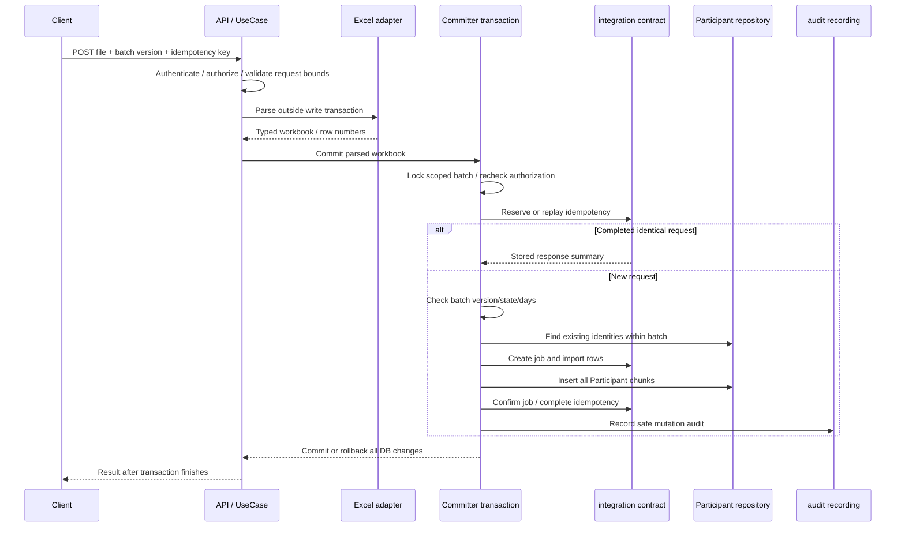

# Kế hoạch import Participant bằng Excel, tải template và lấy danh sách

> Dành cho người triển khai: thực hiện lần lượt các task bằng `superpowers:executing-plans`; chỉ dùng subagent khi được yêu cầu. Đây là tài liệu thiết kế và kế hoạch, không phải xác nhận runtime đã triển khai hoặc tests đã chạy.

**Ngày:** 2026-10-06.

**Mục tiêu:** Có ba use case backend theo từng Organization/Batch: tải template `.xlsx`, import Participant và lấy danh sách phân trang.

**Kiến trúc:** `healthexamination` sở hữu Participant, validation nghiệp vụ và API; `integration` sở hữu lịch sử import/idempotency qua published contracts; `audit::recording` ghi audit cùng transaction. Controller → command/query → use case → domain/port → adapter MyBatis/Excel.

**Stack giữ nguyên:** Java 25, Spring Boot 4 / Framework 7, PostgreSQL 18, MyBatis, Spring Modulith, Maven, Flyway. Đề xuất thêm Apache POI `poi-ooxml` cho adapter Excel; chọn và pin bản stable tương thích khi triển khai, không lấy API từ nhánh trunk làm căn cứ chọn version.

**Trạng thái:** Người dùng đã yêu cầu lập kế hoạch khôi phục chức năng và đã chốt **chỉ thêm mới; có CCCD trùng trong batch thì từ chối toàn bộ file**. Các lựa chọn khác dưới đây là đề xuất thiết kế, chưa trở thành accepted business/API contract.

## 1. Nguồn áp dụng và hiện trạng

### 1.1. Tài liệu nguồn

- [PROJECT_RULES](../../PROJECT_RULES.md): layering, API envelope, pagination, transaction, logging, concurrency và verification.
- [PROJECT_SKILLS](../../PROJECT_SKILLS.md), [skill use case](../../.agents/skills/nkc-backend-use-case/SKILL.md).
- [ADR-0012](../adr/0012-clean-slate-module-boundaries.md): module ownership.
- [ADR-0013](../adr/0013-clean-slate-application-contract.md): Participant và quyết định loại bỏ roster import.
- [ADR-0014](../adr/0014-session-cookie-redis-login.md): session cookie/Redis và Origin protection.
- [Domain workflows](../architecture/03-domain-and-workflows.md), [module contracts](../architecture/02-module-contracts.md), [API/security](../architecture/05-api-and-security.md).
- [V001](../../src/main/resources/db/migration/V001__create_clean_slate_schema.sql), [V002](../../src/main/resources/db/migration/V002__add_health_examination_batch_soft_delete.sql).

### 1.2. Hiện trạng đã đối chiếu source

| Thành phần | Có hiện tại | Phần cần bổ sung |
|---|---|---|
| Batch API | OrganizationBatchController: create/get/list/update/delete | API Participant riêng |
| Participant domain | HealthExaminationBatchParticipant, Roster, Progress và factory create | Tái sử dụng, không tạo aggregate Participant cấp Organization |
| Participant repository | findById, save dùng expected version | insertMany, duplicate lookup và list/count projection |
| Participant mapper/XML | Đọc aggregate, update, lưu ParticipantService | SQL insert header Participant và list/count |
| Import history | ImportJobRecord, ImportRowRecord và bảng V001 | Published contract và adapter runtime; không đọc foreign mapper |
| Idempotency | IdempotencyKeyRecord và bảng V001 | Reservation/replay/complete thực sự |
| Excel | pom.xml chưa khai báo POI | Dependency và parser/template adapter |
| Security | /api/v1/** yêu cầu ACCOUNT_STAFF; principal có permission authorities | RBAC theo endpoint/use case và scope Organization/Batch |
| API surface test | HealthExaminationApiSurfaceTest cấm cả import/template và list Participant cũ | Cập nhật allowlist theo contract mới, giữ các route ngoài phạm vi bị cấm |

`HealthExaminationBatchParticipantRepository.save()` hiện là **update**, không phải upsert; không dùng nó để tạo Participant mới.

Tại thời điểm đọc, ba tài liệu được các nguồn khác liên kết nhưng không tồn tại: `docs/api/clean-slate-migration.md`, `docs/maintenance/code-follow-ups.md`, `.agents/skills/nkc-backend-use-case/references/organization-flow.md`. Không coi các liên kết đó là bằng chứng contract đã có; dùng source/ADR hiện hữu và tạo tài liệu API mới đúng phạm vi ở Task 0.

Có thay đổi sẵn trong `scripts/auth/provision-staff.sql` và `src/main/resources/application-local.yaml`; người triển khai phải kiểm tra lại worktree và giữ nguyên công việc ngoài phạm vi.

### 1.3. Điểm thay đổi contract cần xử lý trước runtime

ADR-0013, PROJECT_RULES §14 và domain/module architecture ghi workflow Excel bị loại bỏ ngày 2026-10-05. Yêu cầu lập kế hoạch này cho phép viết phương án khôi phục, nhưng không đồng nghĩa toàn bộ policy dưới đây đã được chốt hoặc runtime đã được phép thay đổi.

Task 0 phải ghi nhận amendment thay thế phạm vi removal cho đúng ba chức năng này. Không phục hồi mặc định preview/confirm/cancel, không dùng sự tồn tại của `import_jobs`/`import_rows` để suy diễn workflow. Nếu accepted documents vẫn mâu thuẫn, dừng task runtime phụ thuộc, tiếp tục phần tài liệu độc lập.

ADR-0014 và source SecurityConfiguration hiện yêu cầu STAFF trên business routes, dùng Origin/Referer allowlist cho mutation và **không dùng CSRF token**. Không sao chép mô tả production deny-all hoặc CSRF token trong kế hoạch cũ, không đổi login protocol trong task Participant.

## 2. Phạm vi và các lựa chọn

### 2.1. Phương án đề xuất

**Import đồng bộ có giới hạn, nguyên tử, chỉ thêm mới.** Người dùng tải template của batch, điền roster, upload; backend kiểm tra toàn bộ trước khi commit. Một lỗi bất kỳ làm toàn bộ import thất bại. Import thành công có lịch sử và idempotency để retry an toàn.

| Phương án | Ưu điểm | Chi phí / hạn chế | Lựa chọn |
|---|---|---|---|
| Đồng bộ, toàn bộ hoặc không ghi gì | Ba endpoint, transaction rõ, phản hồi ngay | Phải giới hạn file/dòng và đo thời gian/memory | Đề xuất MVP |
| Upload → preview → confirm | Người dùng xem trước từng dòng; phù hợp mapping phức tạp | Thêm job lifecycle, expiry, revalidation, endpoint và cleanup | Chỉ thêm nếu chủ dự án yêu cầu |
| Import một phần / upsert | Ít thao tác sửa file | Cần rule ghi đè, expected version từng Participant và báo kết quả từng dòng | Không phù hợp quyết định đã chốt |

### 2.2. Các quyết định cụ thể

- Participant thuộc **một batch**. API luôn mang `organizationId` và `batchId`.
- CCCD là `identification_number` kiểu text; giữ số 0 đầu, dùng so sánh chính xác.
- Chỉ thêm mới, không update/merge/restore Participant bằng import.
- Trùng trong file hoặc đã tồn tại trong cùng batch, kể cả CANCELLED → từ chối toàn bộ file.
- CCCD ở batch khác → được phép. Mỗi đợt giữ snapshot thông tin của riêng nó.
- CCCD trong bảng Patient → không làm import thất bại. Import không tạo, tìm liên kết hoặc cập nhật Patient/Encounter; liên kết thuộc use case chuẩn bị lượt khám.
- `participantCode` tùy chọn, không phát sinh tự động, không suy diễn là khóa unique.
- Roster mới: ACTIVE; attendance UNCONFIRMED; reconciliation PENDING; `patientId`, `preparedAt`, actual attendance và các actor reconciliation đều null; `rowVersion=0`; không tạo ParticipantService.
- Đề xuất chỉ import vào batch DRAFT hoặc READY, chưa soft delete, Organization ACTIVE. FINALIZED/CLOSED → 409. Đây là policy mới cần chốt ở Task 0; baseline chưa quy định đủ quyền thêm roster theo từng trạng thái.
- List đọc batch chưa soft delete ở mọi lifecycle, gồm Organization INACTIVE nếu người gọi được phép đọc lịch sử. Không đi qua Organization get hiện đang ẩn INACTIVE để quyết định batch không tồn tại.
- List mặc định gồm ACTIVE và CANCELLED; có filter riêng. Không tự ẩn dữ liệu lịch sử.
- Không triển khai frontend, export roster đã có, manual CRUD, chuẩn bị lượt khám, attendance, reconciliation, mapping cột tùy biến hoặc chạy job nền.

### 2.3. Vì sao không tự cập nhật khi CCCD trùng?

Thông tin Participant là snapshot của đợt khám, có thể gắn attendance, Patient, Encounter và hồ sơ đã phát hành. Ghi đè từ Excel có thể làm mất lịch sử hoặc tạo sai liên kết. Nếu cần sửa sau này, thiết kế use case riêng có permission, expected Participant version, kiểm tra dữ liệu đã phát hành và audit.

CCCD trùng cùng batch nhưng Participant CANCELLED cũng không được insert lại: unique `(batch_id, identification_number)` áp dụng mọi roster status. Khôi phục phải là một quyết định nghiệp vụ riêng.

## 3. Contract HTTP đề xuất

Base: `/api/v1/organizations/{organizationId}/health-examination-batches/{batchId}/participants`.

| Hành vi | Method / suffix | Input | Thành công |
|---|---|---|---|
| List | GET base | Query phân trang/filter/sort | 200 + ApiResponse<PageResponse<ParticipantSummaryResponse>> |
| Download template | GET /import-template | Hai path UUID | 200 + binary .xlsx |
| Import | POST /imports | multipart file + rowVersion, header Idempotency-Key | 201 + ApiResponse<ParticipantImportResponse> |

Đây là route mới. Không âm thầm alias các route cũ `export-template`, `participant-imports`, preview/confirm/cancel. Không thêm Location trỏ tới GET job chưa tồn tại.

### 3.1. Import request và response

`Content-Type: multipart/form-data`:

- `file`: đúng một file `.xlsx`, không rỗng.
- `rowVersion`: Long bắt buộc, >= 0; expected version của batch configuration lúc tải template/chuẩn bị import.
- `Idempotency-Key`: UUID do client sinh, bắt buộc. Khi timeout, retry đúng file/version/key. Khi sửa file, lấy key mới.
- Cookie session và Origin/Referer theo ADR-0014. Actor chỉ từ authenticated principal, không nhận từ body/header tùy ý.

```json
{
  "result": "OK",
  "code": 201,
  "data": {
    "importJobId": "019a0000-0000-7000-8000-000000000001",
    "batchId": "019a0000-0000-7000-8000-000000000002",
    "totalRows": 25,
    "createdCount": 25,
    "completedAt": "2026-10-06T03:00:00Z"
  }
}
```

Ví dụ minh họa, không phải output runtime. Replay trả nguyên status/body 201 đã lưu, bao gồm cùng importJobId và completedAt; không tạo job/Participant/audit mới. Một file giống nhau nhưng key mới vẫn bị duplicate validation chặn nếu đã được import.

Không trả toàn bộ danh sách Participant trong import response. Client refresh API list sau thành công.

### 3.2. Lỗi và báo dòng

Giữ envelope hiện hữu `result`, numeric `code`, `message`; không tự thêm `errors`, public string error code hoặc raw rejected value.

| Trường hợp | HTTP | Ví dụ safe message |
|---|---|---|
| File thiếu/rỗng, không đúng OOXML, cột sai, giá trị/cell type sai | 400 | Row 8: identification_number must be a text cell |
| Duplicate CCCD giữa các dòng của file | 409 | Duplicate participant identity at rows 4 and 9 |
| CCCD đã có trong batch | 409 | Participant identity already exists in this batch at row 6 |
| Expected batch version stale | 409 | Record was changed by another request |
| Idempotency key cũ với fingerprint khác | 409 | Idempotency key was used for another request |
| Batch state không cho import | 409 | Batch does not accept Participant imports |
| Không login / không đủ quyền | 401 / 403 | Shared safe error envelope |
| Organization/Batch không khớp hoặc batch deleted | 404 | Health examination batch not found |
| Quá giới hạn upload | 413, contract mới cần handler/test | Upload exceeds the permitted size |
| Kiểu file không hỗ trợ | 415, contract mới cần handler/test | Only XLSX workbooks are supported |
| Redis không phục vụ authentication | 503 | Shared dependency-unavailable message |

Một response trả lỗi đầu tiên theo thứ tự kiểm tra xác định, nêu số dòng Excel thực và field nếu biết. Duplicate trong DB được pre-check để có row number; nếu unique constraint thua do race thì trả 409 generic, không đưa SQL/CCCD ra ngoài.

Nếu cần bảng nhiều lỗi để UI tô từng dòng, bổ sung public contract riêng ở giai đoạn sau; không lợi dụng HTTP 200 cho import thất bại.

### 3.3. Template download

- `Content-Type: application/vnd.openxmlformats-officedocument.spreadsheetml.sheet`.
- `Content-Disposition: attachment; filename="participant-import-template.xlsx"`.
- `Cache-Control: no-store`; dùng tên file cố định, không chèn tên công ty/batch từ dữ liệu.
- Body là bytes XLSX; lỗi vẫn trả JSON envelope đúng media type. Không bọc file trong ApiResponse hoặc encode base64 trong JSON.
- `GetParticipantImportTemplateUseCase.execute(organizationId, batchId, principal)` trả application response gồm bytes; controller chỉ thêm HTTP headers.
- Sinh template sau kiểm tra permission/scope. Không mở DB transaction xuyên suốt việc render workbook.

## 4. Contract Excel V1

### 4.1. Workbook và mapping

Workbook có sheet `Participants` để nhập và `Instructions` để hướng dẫn. Header ở dòng 1; dòng dữ liệu bắt đầu từ 2. `Instructions` chứa templateVersion=1, batchId, batchRowVersion lúc tạo, các ngày khám hợp lệ và ví dụ tổng hợp. Không prefill dữ liệu người thật.

Metadata chỉ giúp người dùng đối chiếu; backend không dùng metadata Excel để xác thực, chọn batch hoặc cấp quyền. Metadata batch/version nếu khác request → 400 yêu cầu tải lại template; source of truth vẫn là path/version và DB. Mọi revalidation bắt buộc làm lại trước commit.

| Cột | Bắt buộc | Kiểu trong Excel | Mapping / validation |
|---|---|---|---|
| participant_code | Không | TEXT | Roster.participantCode, blank → null; không tự sinh |
| full_name | Có | TEXT | Roster.fullName; nonblank, <= 200 theo domain |
| date_of_birth | Có | TEXT `yyyy-MM-dd` | LocalDate hợp lệ; không suy diễn theo locale |
| sex | Có | TEXT/dropdown | MALE, FEMALE, OTHER, UNKNOWN theo Roster |
| identification_number | Có | TEXT | IdentificationNumber: digits, dài 1..20 theo domain hiện hữu |
| phone | Không | TEXT | Giữ số 0 đầu; blank → null |
| email | Không | TEXT | Blank → null; chưa tự thêm rule business email mới |
| department_name | Có | TEXT | Roster.departmentName nonblank |
| position_name | Có | TEXT | Roster.positionName nonblank |
| examination_date | Có | TEXT `yyyy-MM-dd` | Lookup ngày trong batch → batchDayId |

Không tự ép CCCD đúng 12 ký tự: domain hiện tại cho digits dài tối đa 20. Nếu chủ dự án muốn chuẩn CCCD 12 số, phải đổi contract/domain/tests chung; không đặt rule riêng chỉ ở Excel.

`examination_date` được chọn từ ngày của batch, không nhập UUID batchDay. Ngày hợp lệ nhưng không thuộc batch là business conflict 409.

### 4.2. Quy tắc parser

1. Kiểm tra file size, extension/type và package OOXML thật trước khi đọc cell. Không tin MIME/extension đơn lẻ; từ chối XLS, XLSM, workbook có VBA, encryption hoặc external links.
2. Chỉ sheet Participants có dữ liệu import. Instructions bắt buộc cho template V1; từ chối sheet lạ có dữ liệu, header thiếu/lặp/thừa hoặc merged cells trong vùng nhập.
3. Header là machine key đúng như bảng; mapping theo tên, cho phép đổi thứ tự cột. Trim header, không dịch tên hoặc đoán cột gần giống.
4. Dòng trống hoàn toàn được bỏ qua; dòng có bất kỳ giá trị nào phải đủ field required. Blank optional → null. File không có dòng dữ liệu → 400.
5. Kiểm tra CellType trước khi dùng formatter. Từ chối FORMULA, ERROR, BOOLEAN và NUMERIC ở các cột TEXT; không dùng cached formula value hoặc FormulaEvaluator.
6. CCCD/phone nhập numeric → lỗi, không tự pad số 0 hoặc chuyển scientific notation. Tránh tạo dữ liệu khác với ý định người nhập.
7. Cả hai cột ngày chỉ nhận text ISO. Numeric Excel date được báo lỗi format; lựa chọn này tránh phụ thuộc 1900/1904 epoch hoặc timezone. Parser dùng strict LocalDate parsing, không đổi ngày thành Instant.
8. CCCD giữ nguyên chuỗi, không trim hoặc sửa để so khớp; khoảng trắng khiến validation thất bại. Các text mô tả được trim hai đầu, giữ dấu/case; không bỏ dấu để tìm identity.
9. Parser trả typed rows và số dòng Excel thực. Application dùng Roster/IdentificationNumber cho invariants, không chép lại regex hoặc gender allowlist thành phiên bản riêng.
10. Đóng InputStream/workbook/package bằng try-with-resources. Không giữ raw XLSX sau request và không log filename, cell, row, request, CCCD hay tên người.

### 4.3. Giới hạn kỹ thuật đề xuất

Các con số sau là resource budget khởi điểm, không phải business rule đã có; Task 0 chốt và Task 6 đo để hiệu chỉnh trước phát hành.

| Giới hạn | Đề xuất |
|---|---|
| File nén | 5 MiB; multipart request tối đa 6 MiB |
| Dòng dữ liệu | 1..1.000; vùng nhập chỉ trong dòng Excel 2..1.001 |
| Cột nhập | Đúng 10 cột |
| Text mỗi cell | <= 500 ký tự; full_name vẫn <= 200 |
| ZIP package | <= 128 entries, từng entry <= 16 MiB, tổng giải nén <= 32 MiB |
| Insert chunk | 200 Participant/chunk trong cùng transaction |

Giữ POI ZIP-bomb ratio protection; cấu hình giới hạn static một lần lúc bootstrap, không thay đổi per-request. Kiểm tra tổng package size/entry count trước XSSFWorkbook; không coi giới hạn số dòng hay `setMaxTextSize` là giới hạn tổng memory workbook. Shared strings/styles cũng cần nằm trong archive budgets. Parser phải giới hạn sparse row index, không chỉ đếm row có dữ liệu.

Không tạo unlimited concurrent import executor; xử lý đồng bộ theo request và đo tải thực tế. Nếu memory/latency không đạt, giảm budget hoặc đổi SAX parser trong cùng adapter; chỉ thêm workflow nền khi có yêu cầu rõ.

### 4.4. Sinh template

- XSSFWorkbook, text format `@` cho tất cả cột nhập, freeze header, widths cố định, header dễ đọc.
- Hướng dẫn tiếng Việt tại Instructions; dòng dữ liệu Participants để trống, không có sample row dễ bị import nhầm.
- Dropdown sex bằng danh sách enum hợp lệ. Dropdown examination_date từ range tại Instructions dùng named range thay vì nối một chuỗi dài; tránh giới hạn explicit-list validation của Excel.
- Hướng dẫn CCCD/phone phải là text và ngày ISO. Dropdown/format là hỗ trợ nhập, backend vẫn validate vì người dùng có thể paste sai.
- Ghi text với `setCellValue(String)`, không tạo formula từ nội dung nhập. Template không có formula, macro hoặc external link.

## 5. Thiết kế application và transaction

### 5.1. Các contract chính

Tên dưới đây là proposed interfaces, không phải source đã tồn tại. Prefix đường dẫn Java: `src/main/java/com/ngockhanh/clinic/`.

```java
// healthexamination.application.usecase
ParticipantImportTemplateResponse GetParticipantImportTemplateUseCase.execute(
    UUID organizationId, UUID batchId, UserPrincipal principal);

ParticipantImportResponse ImportParticipantsUseCase.execute(
    UUID organizationId, UUID batchId,
    ImportParticipantsCommand command, UserPrincipal principal);

PageResponse<ParticipantSummaryResponse> ListParticipantsUseCase.execute(
    UUID organizationId, UUID batchId,
    ParticipantListQuery query, UserPrincipal principal);
```

`ImportParticipantsCommand` gồm `byte[] workbook`, required `Long rowVersion`, `UUID idempotencyKey`; defensive copy binary. Không chứa MultipartFile, HttpServletRequest, HTTP DTO, originalFilename hay actor từ client. Byte array chỉ dùng ở I/O boundary, business collections dùng List.

`ParticipantExcelReader.read(byte[])` → `ParticipantWorkbook` trong `application/query`: templateVersion, templateBatchId, templateBatchVersion, `List<ParticipantImportRow>`. Row gồm rowNumber và 10 field typed; ngày dùng LocalDate, các field text nullable theo requiredness. Reader không truy vấn DB.

`ParticipantTemplateWriter.write(ParticipantTemplateData)` → bytes. TemplateData gồm batchId, batch version, `List<LocalDate>`; gender rules phải lấy từ nguồn domain chung hiện hữu hoặc extraction có test bảo vệ, không tạo allowlist độc lập dễ lệch.

`ParticipantImportCommitter.commit(scope, commandMetadata, parsedWorkbook, principal, fingerprint)` là application service bean riêng, được gọi qua Spring proxy và `@Transactional`. Không đặt parse Excel trong transaction ghi; không dùng self-invocation để gọi transactional method.

### 5.2. Luồng import nguyên tử



Thứ tự chi tiết:

1. HTTP filter xác thực STAFF, Origin và endpoint permission. Application authorizer kiểm tra supported caller/principal trước xử lý file nặng; actor UUID đơn lẻ không đủ chứng minh quyền.
2. Kiểm tra request/file bounds; parse Excel và structural row rules ngoài write transaction.
3. Fingerprint SHA-256 của canonical encoding gồm organizationId, batchId, expected version, template/parser version và SHA-256 raw bytes. Dùng length-prefix/fixed-width rõ ràng, không nối chuỗi tùy ý; không dùng filename hoặc fullName.
4. Trong commit transaction, scope/lock batch theo cả organizationId và batchId, `deleted_at IS NULL`, `FOR UPDATE`. Recheck quyền và Organization/state theo policy mới. Lock order thống nhất: batch → idempotency → import job → Participant writes.
5. Integration reserve `(scope, actor_key, request_key)`; scope gồm import operation và batchId, actor_key là account ID. Key/hash giống và COMPLETED → đọc stored summary, trả replay **trước expected-version check**, không ghi lại audit.
6. Key đã dùng với hash khác → 409. New request → kiểm tra expected batch version, metadata và import state; resolve toàn bộ examination_date sang batchDayId từ batch vừa lock.
7. Validate duplicate nội bộ bằng Map<IdentificationNumber, Integer>. Query CCCD hiện có theo batch cho tất cả identities; không lọc roster_status. Không query Patient để quyết định duplicate.
8. Nếu còn lỗi, throw đúng failure type; transaction rollback reservation. Không lưu VALIDATED job giả cho file thất bại.
9. Integration tạo job VALIDATED và rows với payload typed serialized trong adapter. Ghi import_type=`ORGANIZATION_PARTICIPANT` theo V001 dù nghiệp vụ là batch Participant; không đổi enum SQL để đẹp tên.
10. Application tạo UUIDv7 cho Participant và gọi factory `HealthExaminationBatchParticipant.create(..., importJobId, sourceRowNumber, clock.instant())`; không tạo Patient/Encounter/service/history khám.
11. insertMany theo chunk 200 trong **cùng** transaction; thiếu affected row hoặc constraint/audit failure làm rollback toàn bộ. Không commit từng chunk, không `ON CONFLICT DO NOTHING` cho Participant.
12. Integration liên kết committed_resource_type/id trên mỗi import row, chuyển job CONFIRMED, ghi confirmed_by/at/result và tăng job row_version có expected-version predicate. Complete idempotency với safe summary của response.
13. Audit `IMPORT_BATCH_PARTICIPANTS`, resource type HEALTH_EXAMINATION_BATCH, resourceId=batchId; metadata gồm importJobId, counts, batchId và expected version, không có rows/CCCD/tên.
14. Transaction kết thúc rồi controller trả response. Log trong transaction dùng pending-commit; không gọi nó là committed success. Replay không có mutation log mới.

Tất cả adapter integration/audit phải dùng cùng datasource/transaction manager và tham gia transaction hiện tại; không `REQUIRES_NEW`, không HTTP call nội bộ. Import không có external effect nên không cần outbox hay lưu file qua document module.

Participant insert không thay batch configuration nên đề xuất giữ nguyên header row_version. Expected batch version kiểm tra cấu hình, không biểu diễn version toàn roster; batch lock và constraints giải quyết race. Mỗi Participant mới có version 0. Nếu muốn tăng batch version khi roster đổi, phải chốt lại ngữ nghĩa version và cập nhật cả các callers liên quan trước triển khai.

### 5.3. Idempotency và race

- Reservation PROCESSING và completion COMPLETED nằm trong cùng transaction. Crash/exception trước commit làm reservation biến mất; không để khóa PROCESSING vĩnh viễn.
- Với key race, integration dùng insert-on-conflict cho **idempotency table** rồi đọc row bằng lock và so sánh fingerprint; không catch unique exception và tiếp tục query trong PostgreSQL transaction đã abort.
- Hai request cùng batch serial hóa tại batch lock; request thứ hai cùng key trả replay, khác key có CCCD trùng trả 409.
- Hai batch khác nhau có cùng CCCD vẫn import được do unique scope theo batch.
- Import chạy đồng thời update/delete batch: dùng cùng batch lock; sau import, delete phải thấy Participant và import history rồi từ chối. Update không được xóa day đã được Participant tham chiếu.
- Replay vẫn phải được authorize và scope tài nguyên hiện tại; idempotency không bypass access. Không ưu tiên stale version trước replay của request đã commit.
- Đề xuất giữ idempotency receipt ít nhất 24 giờ, lịch sử import/Participant không xóa để làm sạch key. Expiry cần retention policy được chốt; sau cửa sổ retry, duplicate constraint vẫn ngăn thêm lại.

## 6. Ownership integration và persistence

### 6.1. Published contracts mới

Đề xuất `integration::participant-imports`, chỉ publish application contract trong `integration/application/imports/`; package-info phải khai báo NamedInterface và ModuleVerificationTest chứng minh không tạo dependency cycle.

Contract này không import `healthexamination` domain/response. Các method/type được chốt ở Task 0:

```java
ImportReservation reserve(ImportRequestIdentity request);
UUID createValidatedJob(ValidatedParticipantImport input);
void markRowsCommitted(UUID jobId, List<CommittedImportRow> rows);
void confirmJob(UUID jobId, long expectedVersion, ImportReceipt receipt);
void completeRequest(UUID reservationId, ImportReceipt receipt);
```

- `ImportRequestIdentity`: organization/batch IDs, actor ID, UUID key, 32-byte hash; defensive copy.
- `ImportReservation`: sealed New(reservationId) / Replay(receipt); typed outcomes, không dùng Map làm business contract.
- `ValidatedParticipantImport`: batchId, actorId, typed configuration với templateVersion và expected batch version; List<staging row>. Staging row DTO là contract integration tự sở hữu, không expose ImportRowRecord.
- `CommittedImportRow`: source row number, resource type và UUID. ImportReceipt gồm importJobId, batchId, totalRows, createdCount, completedAt; mapping sang HTTP response tại healthexamination.
- Serialization JSONB, SQL, records ở integration infrastructure; healthexamination không đọc import tables bằng mapper riêng hoặc join để làm list.

### 6.2. Participant writes và reads

Mở rộng domain repository chỉ cho write/domain lookup thực sự cần:

```java
void insertMany(List<HealthExaminationBatchParticipant> participants);
List<IdentificationNumber> findExistingIdentities(
    AggregateId batchId, List<IdentificationNumber> identities);
```

List là read projection, không restore toàn aggregate rồi gọi findServices cho từng người. Tạo application port `ParticipantListReader` với `readPage(organizationId, batchId, query)` trả typed ParticipantPage; infrastructure projection map sang application query contract, use case map sang response.

SQL kế hoạch:

- Insert explicit 29 field mapping theo record hiện hữu; các field nullable đúng null, status/rowVersion khớp factory. Kiểm tra affected row count.
- Duplicate lookup: WHERE batch_id=#{batchId} AND identification_number IN (...) bằng bound values; không lọc CANCELLED.
- List/count cùng scope organizationId + batchId + deleted_at IS NULL. Join chỉ các bảng cùng module: batch, day và Participant.
- `COUNT(*)` và projection list dùng cùng filters; `@Transactional(readOnly=true, isolation=REPEATABLE_READ)` cho readPage orchestration nếu contract yêu cầu total/items cùng snapshot. Không giữ read transaction qua Excel render.
- SQL sort bằng MyBatis `<choose>` allowlist; không `${sortKey}` hoặc `${searchKey}`.
- Insert predicate/lock bảo vệ deleted batch, cùng cơ chế concurrency của batch update/delete; verify bằng DB tests, không chỉ mock.

### 6.3. Migration

V001/V002 đã có Participant, days, composite FK scope, unique batch+identity, provenance, import history và idempotency. Không sửa migrations đã áp dụng, không tạo bảng staging mới chỉ vì tiện.

Chưa cần migration bảng Participant cho ba use case theo thiết kế này. Migration mới chỉ khi có thay đổi đã chốt như permission catalog, index có căn cứ, hoặc persistence contract thực sự thiếu. Version tiếp theo hiện là V003 nhưng phải kiểm tra lại trước tạo để tránh đụng migration từ công việc song song.

Tái sử dụng `HealthExaminationBatchParticipantRecord`, `ImportJobRecord`, `ImportRowRecord`, `IdempotencyKeyRecord`; projection có suffix View, không tạo record thứ hai cho cùng table.

## 7. List Participant chi tiết

### 7.1. Query đề xuất

| Param | Quy tắc |
|---|---|
| page | Bắt đầu 1, mặc định 1 |
| size | Mặc định 10, max 100 |
| searchKey | Tùy chọn, trim, max 200; tìm tên, participantCode, department, position |
| identificationNumber | Tùy chọn, exact text match theo IdentificationNumber; không fuzzy CCCD |
| batchDayId | Tùy chọn UUID; phải thuộc batch |
| rosterStatus | ACTIVE hoặc CANCELLED; không có = cả hai |
| attendanceStatus | UNCONFIRMED, ATTENDED, ABSENT |
| reconciliationStatus | PENDING, RECONCILED |
| sortKey | id, fullName, participantCode, examinationDate, createdAt; default id |
| sortBy | ASC/DESC; default ASC |

Mọi filter nằm trong DTO HTTP và query application đã validate; caller non-HTTP cũng phải qua validation application. Unknown filter enum/sort key trả 400, không âm thầm bỏ qua.

Text search dùng PostgreSQL, escape `%`, `_`, escape character để coi searchKey là text literal; bind values. Không search raw serialized JSON hay toàn clinical history. Không log searchKey hoặc identificationNumber.

ORDER BY allowlisted key/direction, tie-breaker id cùng hướng, NULLS LAST cho participantCode nullable. Offset tính bằng long để tránh overflow; không load tất cả rồi subList. Khi page vượt cuối, items=[] và totalElements giữ tổng hiện có; khi tập kết quả rỗng, totalPages=0.

### 7.2. Response

ParticipantSummaryResponse đề xuất: id, batchId, batchDayId, examinationDate, participantCode nullable, fullName, dateOfBirth, sex, identificationNumberMasked, departmentName, positionName, rosterStatus, attendanceStatus, reconciliationStatus, actualExaminationDate nullable, preparedAt nullable, rowVersion.

List mặc định không trả full CCCD, phone/email, source payload, import history hoặc clinical content. Mask ở application mapper; không trả raw CCCD dưới field đặt tên masked. Exact identity filter và danh sách tên vẫn là dữ liệu nhạy cảm cần quyền đọc roster; không coi masking là authorization.

Nếu giao diện nghiệp vụ bắt buộc full CCCD/phone/email, chốt fields và permission tương ứng trong API contract trước khi thêm; không tự mở endpoint detail/export ngoài phạm vi.

```json
{
  "result": "OK",
  "code": 200,
  "data": {
    "items": [],
    "page": 1,
    "size": 10,
    "totalElements": 0,
    "totalPages": 0
  }
}
```

Dùng shared PaginationConstants/PageResponse, không thêm pagination envelope riêng. Set Cache-Control no-store cho dữ liệu roster.

### 7.3. Hiệu năng

Unique index batch+identity hỗ trợ exact duplicate lookup và identity filter. Các index batch+day/attendance/reconciliation đã có trong V001. Dùng EXPLAIN với dataset tổng hợp và query thực trước khi đề xuất index mới cho fullName/createdAt/keyword; không thêm trigram/index tất cả field theo suy đoán. List không gọi patient/catalog/ParticipantService N+1.

## 8. Authorization và logging

Per-endpoint permission chưa được triển khai và catalog cụ thể chưa được chốt. Task 0 cần chọn mã permission/read-write và role grants; đề xuất tên `HEALTH_EXAMINATION_PARTICIPANT_READ` và `HEALTH_EXAMINATION_PARTICIPANT_IMPORT`, không khẳng định chúng đang tồn tại.

- List và template → READ; import → IMPORT. Kết hợp ACCOUNT_STAFF với `PERM_<approvedCode>`, không chỉ kiểm tra một actor UUID.
- Application service `ParticipantAccessPolicy` kiểm tra principal permission cho cả HTTP và supported internal callers. Reuse published `accesscontrol::access` UserPrincipal; không đọc mapper accesscontrol trong module này.
- Scope mọi read/write bằng Organization/Batch ownership. Role grants hiện không có location/batch scope; không invent bảng grant hoặc suy diễn quyền theo actor ID. Nếu cần staff chỉ truy cập batch được phân công, đây là contract mới phải xác định trước.
- Kiểm tra quyền trước tiết lộ resource scope/duplicate information; không cho người không có quyền dùng identity filter để dò CCCD.
- Không thay authentication/session/Origin protocol. Multipart POST cũng qua Origin protection như JSON mutation.
- Audit mutation atomic; logs allowlist IDs/count/duration/outcome. Không có per-row INFO, không log contents kể cả ở DEBUG, không log raw SQL/POI exception có thể chứa dữ liệu.
- Header idempotency và session cookie không log. Failure response chỉ field/row/cause category an toàn; central handler sở hữu unexpected failure log.
- Chính sách revocation/RBAC chung còn là go-live blocker theo ADR-0014; permission checks mới không tự giải quyết mọi blocker authentication khác.

## 9. Danh sách file dự kiến

Các path dưới đây tính từ repository root. Chỉ tạo roles có trách nhiệm cụ thể; không scaffolding module mới.

| Path / nhóm file | Hành động | Trách nhiệm |
|---|---|---|
| docs/adr/0013-clean-slate-application-contract.md | Sửa sau chốt | Amendment khôi phục phạm vi import |
| PROJECT_RULES.md §14; docs/architecture/02-module-contracts.md; 03-domain-and-workflows.md; 05-api-and-security.md | Sửa sau chốt | Ownership, lifecycle, permissions và supported routes |
| docs/api/participant-import-and-list.md | Tạo | Request/response, Excel V1, failures/retry và limits |
| pom.xml | Sửa | Pin poi-ooxml, không đổi stack |
| healthexamination/api/controller/BatchParticipantController.java | Tạo | Ba route, HTTP mapping |
| healthexamination/api/request/ImportParticipantsRequest.java; ParticipantListRequest.java | Tạo | Multipart/query structural bounds và toCommand/toQuery |
| healthexamination/application/command/ImportParticipantsCommand.java | Tạo | Binary boundary, version/key |
| healthexamination/application/query/ParticipantListQuery.java; ParticipantImportRow.java; ParticipantWorkbook.java; ParticipantTemplateData.java; ParticipantPage.java | Tạo | Typed application contracts |
| healthexamination/application/response/ParticipantImportResponse.java; ParticipantSummaryResponse.java; ParticipantImportTemplateResponse.java | Tạo | Public response mapping, required fields/defensive copies |
| healthexamination/application/usecase/ImportParticipantsUseCase.java; GetParticipantImportTemplateUseCase.java; ListParticipantsUseCase.java | Tạo | Mỗi lớp một public execute |
| healthexamination/application/service/ParticipantImportCommitter.java; ParticipantAccessPolicy.java | Tạo | Transactional commit và authorization dùng chung |
| healthexamination/application/port/ParticipantExcelReader.java; ParticipantTemplateWriter.java; ParticipantListReader.java | Tạo | Excel/SQL read boundaries |
| healthexamination/domain/repository/HealthExaminationBatchParticipantRepository.java | Sửa | insertMany, duplicate lookup |
| healthexamination/domain/aggregate/HealthExaminationBatchParticipant.java | Chỉ sửa nếu cần | Extraction nguồn gender chung; không đổi unrelated lifecycle |
| healthexamination/infrastructure/excel/PoiParticipantExcelReader.java; PoiParticipantTemplateWriter.java | Tạo | POI adapter |
| healthexamination/infrastructure/configuration/ParticipantImportProperties.java; ParticipantExcelConfiguration.java | Tạo | Bounds và POI configuration một lần |
| healthexamination/infrastructure/persistence/repository/MyBatisHealthExaminationBatchParticipantRepository.java | Sửa | Header insert, duplicate lookup |
| healthexamination/infrastructure/persistence/repository/MyBatisParticipantListReader.java | Tạo | Projection read adapter |
| healthexamination/infrastructure/persistence/view/ParticipantSummaryView.java | Tạo | SQL projection, không expose ra API |
| healthexamination/infrastructure/persistence/mapper/HealthExaminationBatchParticipantMyBatisMapper.java | Sửa | Insert/read/count mapping |
| src/main/resources/mapper/healthexamination/HealthExaminationBatchParticipantMyBatisMapper.xml | Sửa | Bound SQL, scoped predicates, sorting |
| integration/application/imports/package-info.java; ParticipantImportStore.java và typed request/receipt/reservation/row contracts | Tạo | Published interface không phụ thuộc domain module khác |
| integration/infrastructure/persistence/mapper/ParticipantImportMyBatisMapper.java; repository/MyBatisParticipantImportStore.java | Tạo | Dùng records/bảng existing, cùng transaction |
| src/main/resources/mapper/integration/ParticipantImportMyBatisMapper.xml | Tạo | Job/rows/idempotency SQL |
| accesscontrol/infrastructure/configuration/SecurityConfiguration.java | Sửa | Match ba endpoints trước generic STAFF rule |
| src/main/resources/application.yaml | Sửa nếu cần | Multipart + import limits; tránh ghi đè local config sẵn có |
| shared/web/GlobalExceptionHandler.java | Kiểm tra/sửa đúng nơi hiện hữu | 413/415 và safe file parser failures nếu còn thiếu |
| src/main/resources/db/migration/V003__participant_import_permissions.sql | Có điều kiện | Permission codes/grants đã chốt; xác nhận lại số migration |

Java paths trong bảng đều có prefix `src/main/java/com/ngockhanh/clinic/`, trừ paths ghi rõ `src/main/resources/`. Không tạo bản sao record persistence; không tạo entity JPA.

## 10. Các task triển khai và kiểm thử

### Task 0 — Chốt và cập nhật business/API contract

**Đầu vào:** Kế hoạch này và quyết định chỉ thêm mới/toàn bộ hoặc không ghi gì đã chốt.

- [ ] Chốt các đề xuất còn mở: đồng bộ 1.000 dòng, DRAFT/READY, Organization ACTIVE khi import, output masked, lỗi đầu tiên, permission codes/grants và retention receipt.
- [ ] Ghi amendment thay removal ở ADR-0013 và architecture/PROJECT_RULES §14 đúng phạm vi ba use case.
- [ ] Tạo docs/api/participant-import-and-list.md; nêu binary success, multipart, expected version, idempotency/replay và 413/415.
- [ ] Chốt integration::participant-imports contracts/transaction ownership, kiểm tra dependency cycle trước triển khai adapter.
- [ ] Chốt schema permission nếu cần; không tự cấp IMPORT cho mọi STAFF.
- [ ] Kiểm tra links/contract consistency. Không chạy runtime tasks dựa trên đề xuất chưa chốt.

**Hoàn tất:** Không còn mâu thuẫn accepted contracts cho phần sẽ code; API/Excel/authorization có nguồn rõ.

### Task 1 — Hoàn thiện list Participant

**Files:** Controller/request/query/response/ParticipantListReader/View/MyBatisParticipantListReader; mapper Java/XML; access policy và security route tương ứng.

- [ ] Viết `healthexamination/application/usecase/ListParticipantsUseCaseTest.java`: scope mismatch, no permission, all states, defaults, empty và paginated response.
- [ ] Viết `healthexamination/infrastructure/persistence/ParticipantListReaderIntegrationTest.java`: PostgreSQL 18 thật, FK scope, filters, count/items cùng snapshot, wildcard literal, allowlisted sort và stable ties.
- [ ] Viết `healthexamination/api/controller/BatchParticipantControllerTest.java`: query bounds/enums, JSON envelope, masked CCCD và no-store.
- [ ] Chạy từng nhóm để xác nhận fail đúng behavior trước implementation; không lấy missing import/dependency compile failure làm bằng chứng rule test.
- [ ] Implement query/read projection; không dùng restore aggregate/N+1 hoặc query foreign schema.
- [ ] Implement endpoint + application authorization; không dùng controller gọi mapper.
- [ ] Chạy lại nhóm test và review SQL/output fields.

**Hoàn tất:** List không leak full identity, scope đúng, phân trang/sort/filter ổn định và không có writes.

### Task 2 — Excel parser và template download

**Files:** POI dependency, Excel ports/contracts/adapters/properties; template use case và route.

- [ ] Viết `healthexamination/infrastructure/excel/PoiParticipantExcelReaderTest.java`: số 0 đầu, enum, ISO dates, missing/duplicate/reordered header, partial/blank row, real row number, formulas/numeric identity, sparse sheet và package limits.
- [ ] Viết `healthexamination/infrastructure/excel/PoiParticipantTemplateWriterTest.java`: reopen XLSX bằng POI, text styles/header/dropdowns/named range và Instructions; parser đọc lại template điền synthetic rows thành công.
- [ ] Viết `healthexamination/application/usecase/GetParticipantImportTemplateUseCaseTest.java`: permission/scope/deleted/version/dates, không write/audit.
- [ ] Kiểm tra version POI stable hiện hành/Java 25 và compatibility dependency, pin bản cụ thể; tải dependency chỉ khi Task 0 hoàn tất.
- [ ] Implement try-with-resources, cấu hình ZIP limits một lần, preflight archive budgets, safe parser errors.
- [ ] Implement template dùng date/gender source of truth, binary response và Content-Disposition/no-store.
- [ ] Chạy tests. Mở template bằng Excel/LibreOffice nếu có để kiểm tra dropdown, format và hướng dẫn; báo rõ nếu chỉ verify bằng POI.

**Hoàn tất:** Template sinh từ batch và parser tương thích đúng Excel V1; file sai không bị sửa âm thầm.

### Task 3 — Integration history và idempotency

**Files:** integration published contracts, adapter Java/XML, existing records; module verification.

- [ ] Viết `integration/infrastructure/persistence/ParticipantImportStoreIntegrationTest.java`: real JSONB/constraints, reserve/replay/hash mismatch, expected job version và joined caller transaction.
- [ ] Test lỗi sau reserve/job/row write rollback tất cả; cùng key race trả một receipt, không để PROCESSING sau rollback.
- [ ] Implement SQL idempotency reservation/read-lock/complete, job VALIDATED → CONFIRMED và row committed links.
- [ ] Dùng typed payload codecs chỉ trong adapter; source_file_id=null vì không lưu raw file; expires_at cho job confirmed không bị suy diễn thành cleanup Participant.
- [ ] Publish đúng interface và chạy ModuleVerificationTest; integration không import healthexamination internals.

**Hoàn tất:** History/replay thực sự chạy trên PostgreSQL, không là fake in-memory implementation.

### Task 4 — Import use case và atomic Participant insert

**Files:** ImportParticipantsUseCase, Committer, command/response; Participant repository/mapper/XML và controller multipart.

- [ ] Viết `healthexamination/application/usecase/ImportParticipantsUseCaseTest.java`: structural failures, domain rules, duplicate trong file/cùng batch, duplicate CANCELLED, đúng batchDay, batch states và stale version.
- [ ] Test cùng CCCD ở batch khác hợp lệ; mock verifies không gọi Patient/Encounter, nhưng không dùng mock để kết luận DB không ghi các bảng đó.
- [ ] Viết `healthexamination/infrastructure/persistence/ParticipantImportIntegrationTest.java`: FK/provenance/status/version, chunk failure và audit failure rollback, no Patient/Encounter/ParticipantService rows.
- [ ] Extend existing MyBatisHealthExaminationBatchParticipantRepositoryTest đúng insert behavior; không biến save thành upsert.
- [ ] Implement permission/preflight → parse → proxied transactional commit theo thứ tự §5.2; tạo IDs và clock times ở application.
- [ ] Implement insertMany không ignore conflict, duplicate query gồm CANCELLED, single transaction cho toàn bộ chunks/audit/history/idempotency.
- [ ] Implement multipart binding/file bytes ở boundary và safe shared exception mapping; trả 201 chỉ sau commit.
- [ ] Test replay đúng file/key/version trả cùng response dù batch version sau đó đổi; không insert/audit lại. Key cũ/file khác → 409.

**Hoàn tất:** File hợp lệ thêm tất cả; bất kỳ lỗi nào không để dữ liệu import một phần.

### Task 5 — Security, concurrency và API surface

**Files:** `healthexamination/api/controller/ParticipantAccessIntegrationTest.java`, import integration tests, `HealthExaminationApiSurfaceTest.java`, SecurityConfiguration và approved permission migration.

- [ ] Filter-chain tests: anonymous 401; PATIENT 403; STAFF thiếu permission 403; STAFF đúng permission thành công; quyền READ không tự cấp IMPORT.
- [ ] Multipart Origin/Referer tests: missing/foreign origin 403, allowed origin qua đúng flow; không thêm CSRF-token giả.
- [ ] Test scope mismatch không leak identity/history, deleted batch 404, INACTIVE Organization read/import theo policy đã chốt.
- [ ] Hai DB transactions: same-key replay, khác-key trùng CCCD, cùng CCCD khác batch, import vs delete/update day; dùng synchronization/latches thay timing sleep dễ flaky.
- [ ] Test 413 ở multipart resolver/container và 415 với file không hỗ trợ; envelope/media type không leak parser exception.
- [ ] Update ALLOWED_MAPPINGS thêm đúng ba routes; giữ REMOVED_MAPPINGS preview/confirm/cancel và route alias cũ không được phục hồi.
- [ ] Run ModuleVerificationTest, persistence record contract, API surface và security tests.

**Hoàn tất:** Không bypass access, Origin hoặc atomicity qua retry/concurrency; đúng API inventory.

### Task 6 — Hiệu năng, documentation và verify cuối

- [ ] Dataset tổng hợp 1.000 dòng và request quá giới hạn: ghi duration/peak memory, archive preflight rejection, transaction duration; không dùng dữ liệu người thật.
- [ ] EXPLAIN list filters/sorts và duplicate lookup; chỉ thêm Flyway index nếu có bottleneck được chứng minh.
- [ ] Kiểm tra template qua ứng dụng spreadsheet nếu có; ghi kết quả thực tế và hạn chế.
- [ ] Format Java bằng formatter dự án cho files đã đổi; review diff không kéo thay đổi unrelated vào scope.
- [ ] Cập nhật docs/api/participant-import-and-list.md, examples, permission/limits và client retry instructions.
- [ ] Chạy verify đầy đủ, kiểm tra PostgreSQL/Redis integration thực sự có chạy; báo skips/unavailable dependencies/failures.
- [ ] Completion report nêu modules/files/migrations/public APIs/tests/commands/results và các go-live blockers còn lại.

## 11. Lệnh verification khi triển khai runtime

Chạy trong repository root, dùng Maven wrapper, không Gradle/H2.

```powershell
# Nhóm tests tạo ở các task trên: chỉ chạy sau khi các lớp tương ứng tồn tại.
.\mvnw.cmd "-Dtest=ListParticipantsUseCaseTest,ParticipantListReaderIntegrationTest,BatchParticipantControllerTest" test
.\mvnw.cmd "-Dtest=PoiParticipantExcelReaderTest,PoiParticipantTemplateWriterTest,GetParticipantImportTemplateUseCaseTest" test
.\mvnw.cmd "-Dtest=ParticipantImportStoreIntegrationTest,ImportParticipantsUseCaseTest,ParticipantImportIntegrationTest,ParticipantAccessIntegrationTest" test
.\mvnw.cmd "-Dtest=ModuleVerificationTest,HealthExaminationApiSurfaceTest" test

# Định nghĩa hoàn tất bắt buộc với runtime/build changes; verify đã bao gồm test.
.\mvnw.cmd verify
```

PostgreSQL 18 Testcontainers phải chứng minh real SQL/constraints/transaction rollback và race. Redis integration phải chứng minh cookie authentication nếu security tests dựa trên session store thật. Không coi standalone MockMvc/mocked repository hoặc test bị skip là runtime evidence.

Theo pom hiện hữu các test tên IntegrationTest cần được test runner thực thi; kiểm tra Surefire/Failsafe/includes khi thêm, không chỉ tạo class rồi tưởng verify đã chạy. Báo tests count/skip thực tế.

## 12. Acceptance checklist và điều kiện triển khai

- [ ] Ba chức năng có accepted API/business/security contract thay scope removal cũ.
- [ ] Tải template đúng batch/version/dates, Excel text identity giữ số 0 đầu.
- [ ] Import chỉ tạo Participant batch-scoped; không Patient/Encounter/performed services.
- [ ] Trùng cùng batch/file/CANCELLED → 409 và không có partial business/history/audit writes.
- [ ] CCCD đã ở batch khác/Patient không bị coi là duplicate của batch hiện tại.
- [ ] Có source importJobId và actual Excel row number trên mỗi Participant được import.
- [ ] Retry cùng request/key trả kết quả cũ; khác fingerprint không được dùng lại key.
- [ ] Batch version/state/day/deleted guard được kiểm tra lại trong transaction.
- [ ] Authorized list phân trang có stable sort, count đúng và output fields đã chốt.
- [ ] Không log raw file/rows/search/CCCD/names/session/idempotency key.
- [ ] Transaction/audit/concurrency/module/security được chứng minh bằng tests thích hợp.
- [ ] Flyway không sửa lịch sử applied migrations; diff giữ nguyên công việc khác.

**Các lựa chọn chưa được chốt ngoài policy duplicate:** import đồng bộ và budgets, states/Organization import policy, permissions/grants/scope, masked list fields, first-error reporting, idempotency retention. Tài liệu đã mô tả hướng đề xuất đủ để review; không giấu chúng dưới nhãn quyết định đã được chủ dự án phê duyệt.

**Kết quả của công việc lập kế hoạch này:** chỉ tạo file Markdown. Runtime modules, schema, APIs và build dependencies chưa thay đổi; chưa chạy Maven/runtime tests. Các commands ở §11 là hướng dẫn cho giai đoạn triển khai, không phải kết quả đã chạy.

## 13. Tài liệu thư viện đã tra cứu

Đã dùng Context7 để đối chiếu tài liệu chính thức cho multipart binding, proxy transaction và Apache POI. Kiểm tra lại theo version được pin khi thực thi:

- [Spring MVC multipart forms](https://docs.spring.io/spring-framework/reference/web/webmvc/mvc-controller/ann-methods/multipart-forms.html).
- [Spring transaction annotations và self-invocation](https://docs.spring.io/spring-framework/reference/data-access/transaction/declarative/annotations.html).
- [Apache POI configuration và ZipSecureFile budgets](https://poi.apache.org/components/configuration.html).
- [Apache POI spreadsheet guide](https://poi.apache.org/components/spreadsheet/quick-guide.html).

Không dùng cached formula output để bypass CellType validation; không coi ZIP ratio protection là giới hạn tổng workbook memory. Dependency/API thuộc version stable đã pin, không nhánh trunk hay ví dụ JPA/Hibernate.
